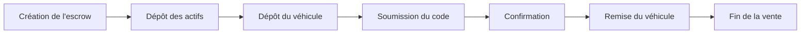
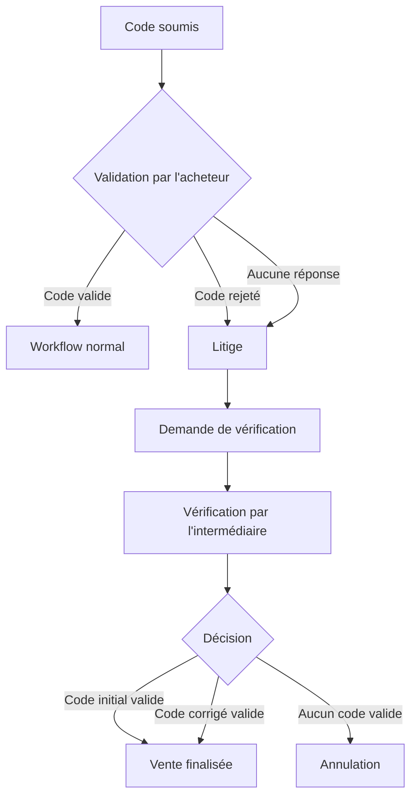
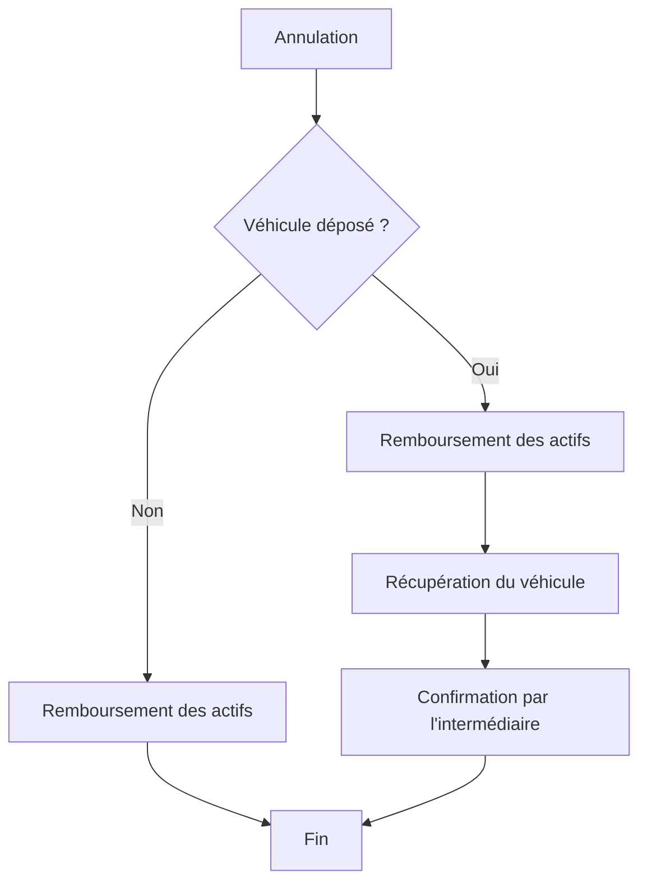
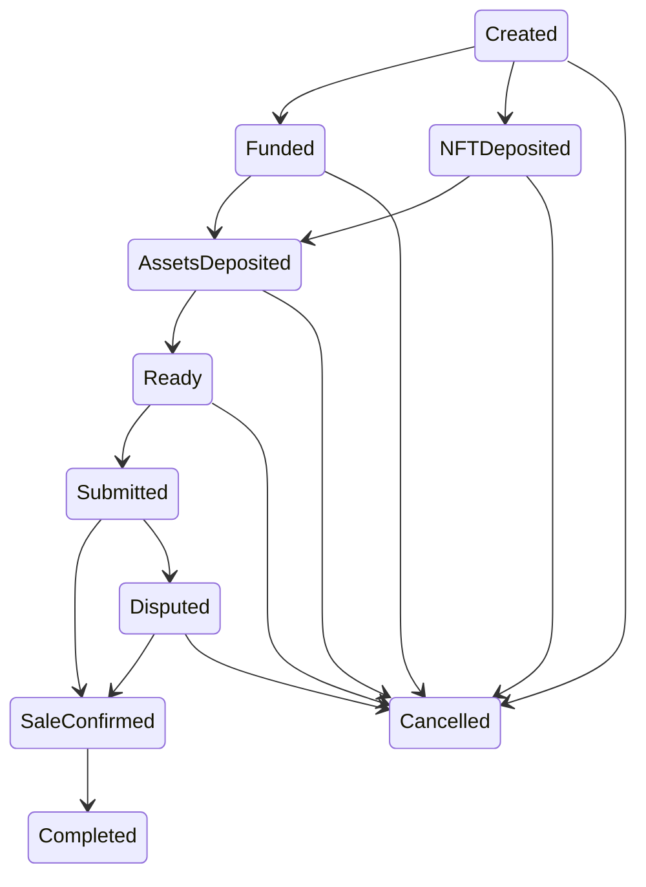

# 1. Introduction

## 1.1 Présentation

**VehicleSaleEscrow** est un smart contract Solidity implémentant un mécanisme d'entiercement (*escrow*) destiné à sécuriser la vente d'un véhicule entre deux particuliers.

Son objectif est de garantir que les actifs numériques impliqués dans la transaction sont transférés uniquement lorsque les conditions prévues par le protocole sont satisfaites.

Le contrat conserve temporairement les fonds de l'acheteur ainsi que le NFT représentant le véhicule, applique les différentes règles de la vente et automatise la distribution des actifs à chaque étape du processus.

Le protocole complet repose également sur plusieurs opérations réalisées hors chaîne, notamment les démarches administratives auprès de la plateforme ANTS et les échanges physiques du véhicule. Ces opérations ne sont pas exécutées par le smart contract, mais leurs conséquences sont prises en compte au travers des transactions envoyées par les participants.

---

## 1.2 Objectifs

Le smart contract poursuit plusieurs objectifs :

* sécuriser le paiement de la vente ;
* sécuriser le transfert du NFT représentant le véhicule ;
* garantir le respect du déroulement de la transaction ;
* gérer automatiquement les délais définis par le protocole ;
* permettre la résolution des litiges liés au code de cession ;
* automatiser la redistribution des actifs en cas de succès ou d'annulation de la vente.

---

## 1.3 Participants

Le protocole fait intervenir trois participants.

### Vendeur

Le vendeur est le propriétaire initial du véhicule.

Il est notamment responsable de :

* déposer le NFT dans le contrat ;
* déposer physiquement le véhicule auprès de l'intermédiaire ;
* générer le code de cession sur la plateforme ANTS ;
* transmettre au contrat le code de cession chiffré ainsi que son empreinte cryptographique (*hash*) ;
* demander une vérification lorsqu'un litige survient.

---

### Acheteur

L'acheteur est responsable de :

* déposer le paiement dans le contrat ;
* récupérer et déchiffrer le code de cession ;
* vérifier ce code sur la plateforme ANTS afin de confirmer la cession administrative ;
* confirmer ou rejeter le code de cession ;
* demander la récupération du véhicule ;
* payer les frais de récupération
* déposer les frais de vérification, qui pourront être remboursés ou redistribués selon l'issue de la procédure de vérification.
---

### Intermédiaire

L'intermédiaire est une entité de confiance chargée des opérations qui ne peuvent pas être vérifiées directement par la blockchain.

Il intervient notamment pour :

* confirmer le dépôt physique du véhicule ;
* résoudre les litiges liés au code de cession ;
* confirmer la remise du véhicule à l'acheteur ;
* confirmer la restitution du véhicule au vendeur lorsqu'une vente est annulée.

---

## 1.4 Actifs gérés

Le smart contract manipule plusieurs actifs numériques.

### Paiement

Le prix du véhicule est déposé par l'acheteur sous la forme d'un token ERC20.

Les fonds restent bloqués dans le contrat jusqu'à ce que les conditions de la vente soient satisfaites.

---

### NFT

Le véhicule est représenté par un NFT dont la propriété est temporairement transférée au contrat pendant la durée de la transaction.

Le NFT est ensuite transféré à l'acheteur ou détruit si la vente est annulée.

---

### Code de cession

Le vendeur transmet au contrat :

* une version chiffrée du code de cession ;
* le hash correspondant.

Le code de cession n'est jamais stocké en clair sur la blockchain.

Son hash permet notamment à l'intermédiaire de confirmer, en cas de litige, que le code vérifié hors chaîne correspond bien à celui initialement fourni par le vendeur.

Le code de cession est utilisé par l'acheteur pour confirmer la cession administrative du véhicule sur la plateforme ANTS.

---

### Frais

Le protocole prévoit trois catégories de frais :

* les frais de dépôt ;
* les frais de récupération ;
* les frais de vérification.

Leur répartition dépend du déroulement de la vente et des éventuels litiges.

---

# 2. Architecture du smart contract

Le contrat **VehicleSaleEscrow** implémente la partie *on-chain* du protocole de vente. Il est responsable de l'application des règles métier, de la gestion des actifs numériques et de l'évolution de la transaction tout au long de son cycle de vie.

Le contrat n'interagit jamais directement avec des systèmes externes, tels que la plateforme ANTS. Les opérations réalisées hors chaîne sont matérialisées par les transactions envoyées par les participants autorisés.

---

## 2.1 Machine à états

Le contrat est implémenté sous la forme d'une **machine à états finis** (*Finite State Machine*).

Chaque vente évolue progressivement d'un état à un autre selon le déroulement du protocole. Avant chaque opération, le contrat vérifie que la transition demandée est autorisée par l'état courant.

Cette approche garantit le respect du workflow et empêche l'exécution d'actions incompatibles avec l'avancement de la transaction.

La description détaillée des états est présentée au **chapitre 6**.

---

## 2.2 Contrôle d'accès

Toutes les fonctions modifiant l'état du contrat sont protégées par un contrôle d'accès.

Selon l'opération réalisée, seules les adresses du vendeur, de l'acheteur ou de l'intermédiaire sont autorisées à appeler certaines fonctions.

Le contrat vérifie systématiquement l'identité de l'appelant avant d'autoriser une transition d'état ou un transfert d'actifs.

---

## 2.3 Gestion des délais

Le contrat utilise plusieurs délais afin d'encadrer les différentes étapes de la vente.

Ces délais déterminent notamment les périodes durant lesquelles :

* le vendeur peut transmettre le code de cession ;
* l'acheteur peut confirmer ou rejeter ce code ;
* le vendeur peut demander une vérification auprès de l'intermédiaire.

L'expiration de certains délais autorise automatiquement les transitions prévues par le protocole, telles que l'ouverture d'une procédure de vérification ou l'annulation de la vente.

---

## 2.4 Événements

Le contrat émet des événements à chaque étape importante de la transaction.

Ces événements permettent notamment de :

* suivre l'évolution de la vente ;
* faciliter l'intégration avec une interface utilisateur ;
* conserver un historique transparent des opérations réalisées sur la blockchain.

Les événements constituent également un mécanisme permettant aux applications clientes de réagir automatiquement aux changements d'état du contrat.

# 3. Déroulement d'une vente

Ce chapitre décrit le déroulement nominal d'une vente, depuis le déploiement du contrat jusqu'à la remise du véhicule à l'acheteur.

Les procédures de litige et d'annulation sont volontairement exclues de cette description et seront abordées dans les chapitres suivants.

---

## 3.1 Création de l'escrow

Une nouvelle instance du contrat **VehicleSaleEscrow** est déployée pour chaque vente.

Lors de son déploiement, le contrat est configuré avec l'ensemble des paramètres de la transaction :

* les adresses des participants ;
* les contrats ERC20 et NFT ;
* le prix du véhicule ;
* les frais appliqués par le protocole.

Ces informations restent inchangées pendant toute la durée de vie du contrat.

---

## 3.2 Dépôt des actifs

Avant que la vente puisse commencer, les deux participants déposent les actifs numériques nécessaires.

Le vendeur transfère le NFT représentant le véhicule vers le contrat.

L'acheteur dépose le prix du véhicule ainsi que les frais de vérification.

Une fois ces deux opérations réalisées, le contrat est prêt à poursuivre le processus de vente.

---

## 3.3 Dépôt physique du véhicule

Le vendeur remet ensuite le véhicule à l'intermédiaire.

Cette opération est réalisée hors chaîne.

Après avoir vérifié la réception du véhicule, l'intermédiaire confirme son dépôt sur la blockchain.

Cette confirmation :

* autorise la poursuite de la vente ;
* déclenche le versement des frais de dépôt ;
* ouvre le délai durant lequel le vendeur peut transmettre le code de cession.

---

## 3.4 Transmission du code de cession

Le vendeur effectue les démarches de cession sur la plateforme ANTS, puis récupère le code de cession.

Avant de l'envoyer au contrat, il :

* chiffre le code hors chaîne ;
* calcule son empreinte cryptographique (*hash*) ;
* transmet ces deux informations au smart contract.

Le contrat conserve uniquement le code chiffré et son hash.

Une nouvelle période est alors ouverte afin de permettre à l'acheteur de vérifier le code.

---

## 3.5 Vérification du code

L'acheteur récupère le code chiffré depuis le contrat, le déchiffre hors chaîne puis vérifie sa validité sur la plateforme ANTS.

Si le code est valide, il confirme la vente.

Cette confirmation déclenche automatiquement :

* le paiement du vendeur ;
* le remboursement des frais de vérification à l'acheteur ;
* le transfert du NFT vers l'acheteur.

Le protocole considère alors la vente comme finalisée sur le plan numérique.

---

## 3.6 Remise du véhicule

Après la confirmation de la vente, l'acheteur demande la récupération du véhicule et verse les frais correspondants.

L'intermédiaire remet alors physiquement le véhicule à son nouveau propriétaire.

Une fois cette remise effectuée, il confirme l'opération sur la blockchain.

Le contrat :

* verse les frais de récupération à l'intermédiaire ;
* détruit le NFT représentant le véhicule ;
* marque définitivement la vente comme terminée.

À ce stade, le contrat a rempli l'ensemble de ses responsabilités et la transaction est définitivement clôturée.

# 4. Gestion des litiges

Le protocole prévoit une procédure de résolution des litiges lorsqu'un désaccord survient lors de la vérification du code de cession.

L'objectif de cette procédure est de permettre à un intermédiaire de confiance de vérifier la situation hors chaîne avant que le smart contract ne prenne une décision définitive.

---

## 4.1 Ouverture d'un litige

Un litige peut être déclenché dans deux situations.

### Rejet du code de cession

Après avoir vérifié le code sur la plateforme ANTS, l'acheteur peut constater que celui-ci est invalide.

Le contrat suspend alors la vente et ouvre une période durant laquelle le vendeur peut demander l'intervention de l'intermédiaire.

---

### Absence de réponse de l'acheteur

Si l'acheteur ne confirme pas le code avant l'expiration du délai prévu, le vendeur dispose d'une période supplémentaire pour demander une vérification.

Cette approche évite qu'une vente reste bloquée indéfiniment en raison de l'inaction de l'acheteur.

---

## 4.2 Demande de vérification

Lorsqu'il estime que le litige nécessite une intervention, le vendeur demande officiellement une vérification au smart contract.

À partir de cette étape :

* la vente est suspendue ;
* les autres opérations de la vente sont bloquées ;
* l'intermédiaire devient le seul acteur capable de poursuivre la procédure.

---

## 4.3 Vérification hors chaîne

La vérification est entièrement réalisée hors chaîne.

L'intermédiaire consulte les informations nécessaires afin de déterminer si le code de cession fourni est valide.

Cette analyse peut notamment conduire à constater :

* que le code initial est correct ;
* qu'une erreur de saisie est à l'origine du problème et qu'un nouveau code valide peut être fourni ;
* qu'aucun code valide n'existe.

Le smart contract ne participe jamais à cette vérification. Il applique uniquement la décision enregistrée par l'intermédiaire.

---

## 4.4 Résolution du litige

Le contrat prévoit trois fonctions distinctes permettant à l'intermédiaire d'enregistrer le résultat de son analyse.

### Code initial valide

L'intermédiaire confirme que le code initial fourni par le vendeur est valide.

Le smart contract vérifie que le hash calculé par l'intermédiaire correspond au hash enregistré lors de la soumission du code de cession.

La vente est ensuite finalisée automatiquement.

---

### Code corrigé valide

L'intermédiaire constate qu'un nouveau code valide doit remplacer le code initial.

Le smart contract enregistre le nouveau code chiffré ainsi que son hash, puis poursuit automatiquement la vente.

Cette opération garantit la traçabilité de la correction effectuée.

---

### Aucun code valide

Si aucun code valide ne peut être fourni, l'intermédiaire met définitivement fin à la procédure.

Le smart contract annule alors la vente et applique automatiquement les règles prévues pour une annulation.

---

## 4.5 Fin du litige

Une fois la décision enregistrée, le contrat quitte l'état de litige.

Deux issues sont possibles :

* la vente reprend son déroulement normal jusqu'à son terme ;
* la vente est annulée et les actifs sont redistribués conformément aux règles du protocole.

# 5. Gestion des annulations

Le protocole prévoit plusieurs situations pouvant conduire à l'annulation définitive d'une vente.

Une annulation met fin au contrat en cours et déclenche automatiquement la redistribution des actifs numériques conformément aux règles définies par le smart contract.

Selon l'étape à laquelle intervient l'annulation, une procédure de récupération du véhicule peut également être nécessaire.

---

## 5.1 Annulation avant le dépôt du véhicule

La vente peut être annulée tant que l'intermédiaire n'a pas confirmé la réception du véhicule.

Cette situation correspond à la phase de préparation de la transaction.

Le smart contract :

* rembourse le prix du véhicule à l'acheteur ;
* rembourse les frais de vérification à l'acheteur ;
* Renvoie le NFT représentant le véhicule au vendeur.

Aucune récupération physique n'est nécessaire, puisque le véhicule est toujours en possession du vendeur.

---

## 5.2 Dépassement du délai de transmission du code

Après confirmation du dépôt du véhicule, le vendeur dispose d'un délai limité pour transmettre le code de cession.

Si ce délai expire, la vente peut être annulée.

Le smart contract rembourse les actifs numériques concernés et indique qu'une récupération du véhicule devra être organisée auprès de l'intermédiaire.

---

## 5.3 Absence de demande de vérification

Deux situations peuvent conduire à cette annulation :

* le vendeur ne demande pas de vérification après le rejet du code de cession ;
* le vendeur ne demande pas de vérification après l'expiration du délai de réponse de l'acheteur.

Dans les deux cas, le protocole considère que la vente ne peut plus être poursuivie.

---

## 5.4 Vérification infructueuse

Lorsque l'intermédiaire conclut qu'aucun code de cession valide ne peut être fourni, le contrat annule automatiquement la vente.

Les fonds sont redistribués selon les règles du protocole et le vendeur devra récupérer son véhicule auprès de l'intermédiaire.

---

## 5.5 Récupération du véhicule

Lorsque la vente est annulée après le dépôt physique du véhicule, celui-ci reste sous la responsabilité de l'intermédiaire.

Le vendeur doit alors :

1. demander officiellement la récupération du véhicule ;
2. déposer les frais de récupération dans le contrat.

Après la remise du véhicule, l'intermédiaire confirme cette opération sur la blockchain en detruisant le NFT répresentant le vehicule.

Le contrat verse alors les frais de récupération à l'intermédiaire et clôt définitivement cette procédure.

---

## 5.6 Fin d'une vente annulée

À l'issue d'une annulation :

* les actifs numériques ont été redistribués ;
* le NFT a été détruit ;
* si nécessaire, le véhicule a été restitué au vendeur.

Une fois l'état **Cancelled** atteint, aucune opération ne permet de réactiver la vente.

Toute nouvelle tentative nécessitera le déploiement d'un nouveau contrat d'escrow.

# 6. États du contrat

Les transitions entre ces états sont entièrement contrôlées par le smart contract.

---

## 6.1 États de la vente

| État                | Description                                                                             |
| ------------------- | --------------------------------------------------------------------------------------- |
| **Created**         | Le contrat vient d'être déployé. Aucun actif n'a encore été déposé.                     |
| **Funded**          | Le prix du véhicule ainsi que les frais de vérification ont été déposés par l'acheteur. |
| **NFTDeposited**    | Le NFT représentant le véhicule a été déposé par le vendeur.                            |
| **AssetsDeposited** | Le paiement et le NFT sont tous les deux conservés par le contrat.                      |
| **Ready**           | L'intermédiaire a confirmé la réception physique du véhicule.                           |
| **Submitted**       | Le vendeur a transmis le code de cession chiffré ainsi que son hash.                    |
| **SaleConfirmed**   | La vente est finalisée sur le plan numérique.                                           |
| **Completed**       | Le véhicule a été remis à l'acheteur et la vente est terminée.                          |
| **Disputed**        | La vente est suspendue dans l'attente de la décision de l'intermédiaire.                |
| **Cancelled**       | La vente est définitivement annulée.                                                    |

---

## 6.2 Raisons de litige

Lorsqu'une vente entre dans l'état **Disputed**, le contrat enregistre également l'origine du litige.

| Valeur                 | Description                                                             |
| ---------------------- | ----------------------------------------------------------------------- |
| **None**               | Aucun litige n'est en cours.                                            |
| **CodeRejected**       | L'acheteur a explicitement rejeté le code de cession.                   |
| **BuyerDidNotRespond** | L'acheteur n'a pas répondu avant l'expiration du délai de confirmation. |

Cette information permet au contrat d'appliquer les règles adaptées à chaque situation.

---

## 6.3 Résultats de la vérification

Après analyse du litige, l'intermédiaire peut enregistrer l'un des résultats suivants.

| Valeur                 | Description                                              |
| ---------------------- | -------------------------------------------------------- |
| **OriginalCodeValid**  | Le code de cession initial est valide.                   |
| **CorrectedCodeValid** | Un nouveau code de cession valide remplace le précédent. |
| **NoValidCode**        | Aucun code de cession valide ne peut être fourni.        |

Chaque résultat entraîne automatiquement la poursuite ou l'annulation de la vente.

---

## 6.4 Vue d'ensemble des transitions

Ce diagramme représente les principales transitions possibles entre les états du contrat. Les conditions permettant chacune de ces transitions sont décrites dans les chapitres précédents.

# 7. Gestion des frais

Le protocole prévoit trois catégories de frais, chacune correspondant à une prestation spécifique réalisée par l'intermédiaire de confiance.

Contrairement au prix du véhicule, ces frais rémunèrent les services nécessaires au bon déroulement de la transaction. Leur montant est fixé lors du déploiement du contrat et reste inchangé pendant toute la durée de la vente.

---

## 7.1 Frais de dépôt

Les **frais de dépôt** rémunèrent la prise en charge et la garde du véhicule par l'intermédiaire.

Ils sont versés par le vendeur au moment où celui-ci demande la confirmation du dépôt physique du véhicule.

Après avoir vérifié que le véhicule a bien été remis, l'intermédiaire confirme cette opération sur la blockchain. Le smart contract lui transfère alors automatiquement les frais de dépôt.

Ces frais sont définitivement acquis à l'intermédiaire, même si la vente est ensuite annulée.

---

## 7.2 Frais de récupération

Les **frais de récupération** rémunèrent la remise physique du véhicule.

Selon l'issue de la transaction, ces frais sont versés par :

* **l'acheteur**, lorsque la vente est finalisée avec succès ;
* **le vendeur**, lorsque la vente est annulée après le dépôt physique du véhicule et que celui-ci doit récupérer son véhicule.

Dans les deux cas, les frais sont déposés avant la remise du véhicule.

Après confirmation de cette remise par l'intermédiaire, le smart contract lui transfère automatiquement les fonds.

---
### 7.3 Frais de vérification

Les **frais de vérification** couvrent l'intervention de l'intermédiaire lorsqu'un litige nécessite la vérification du code de cession.

Afin de garantir que les fonds nécessaires sont disponibles, l'acheteur dépose une première fois ces frais lors du financement de la vente, en même temps que le prix du véhicule.

Si un litige survient et que le vendeur demande officiellement une vérification, celui-ci dépose à son tour un montant équivalent dans le smart contract.

À l'issue de la procédure, le contrat redistribue ces deux dépôts selon la décision enregistrée par l'intermédiaire.

* **Code initial valide** : l'intermédiaire reçoit les frais déposés par l'acheteur, tandis que le vendeur récupère les frais qu'il a avancés.
* **Code corrigé valide après rejet du code par l'acheteur** : l'intermédiaire reçoit les frais déposés par le vendeur, tandis que l'acheteur récupère les frais qu'il avait avancés.
* **Code corrigé valide après absence de réponse de l'acheteur** : les frais de vérification sont répartis entre les trois parties. L'intermédiaire reçoit la moitié des frais déposés par le vendeur ainsi que la moitié des frais déposés par l'acheteur. Chaque participant récupère l'autre moitié des frais qu'il avait initialement déposés.
* **Aucun code valide** : les frais de vérification déposés par le vendeur sont transférés à l'intermédiaire. Les frais de vérification initialement déposés par l'acheteur lui sont remboursés.

Cette répartition permet de faire supporter le coût de la vérification à la partie responsable du litige. Lorsque cette responsabilité ne peut être clairement attribuée, le coût est partagé entre le vendeur et l'acheteur.

---

## 7.4 Récapitulatif

| Frais                     | Payeur               | Moment du dépôt                                | Bénéficiaire final                                     |
| ------------------------- | -------------------- | ---------------------------------------------- | ------------------------------------------------------ |
| **Frais de dépôt**        | Vendeur              | Avant la confirmation du dépôt physique        | Intermédiaire                                          |
| **Frais de récupération** | Acheteur ou vendeur* | Avant la remise ou la récupération du véhicule | Intermédiaire                                          |
| **Frais de vérification** | Acheteur et vendeur | L’acheteur les dépose lors du financement de la vente ; le vendeur dépose un montant équivalent lorsqu’il demande une vérification | Intermédiaire et/ou remboursement aux parties, selon le résultat de la vérification |

* L'acheteur paie les frais de récupération lorsque la vente est finalisée. Le vendeur les paie uniquement lorsqu'il doit récupérer son véhicule après une annulation.

---

# 8. Interface du smart contract

Le contrat **VehicleSaleEscrow** expose un ensemble de fonctions publiques permettant aux différents participants d'interagir avec le protocole. Ces fonctions sont réparties selon leur rôle dans le cycle de vie de la vente.

En complément, plusieurs fonctions de consultation permettent aux applications clientes d'accéder à l'état courant du contrat sans modifier la blockchain.

---

## 8.1 Fonctions de gestion des actifs

Ces fonctions permettent de déposer les actifs numériques nécessaires au démarrage de la vente.

| Fonction              | Description                                                                   |
| --------------------- | ----------------------------------------------------------------------------- |
| `fundVehiclePrice()`  | Dépose le prix du véhicule ainsi que les frais de vérification de l'acheteur. |
| `depositVehicleNFT()` | Dépose le NFT représentant le véhicule dans le contrat.                       |

---

## 8.2 Fonctions liées au dépôt et à la remise du véhicule

Ces fonctions permettent de coordonner les opérations physiques réalisées hors chaîne avec l'état du smart contract.

| Fonction                    | Description                                                                             |
| --------------------------- | --------------------------------------------------------------------------------------- |
| `requestVehicleDeposit()`   | Le vendeur demande la confirmation du dépôt physique du véhicule.                       |
| `confirmVehicleDeposit()`   | L'intermédiaire confirme la réception du véhicule et autorise la poursuite de la vente. |
| `requestVehiclePickup()`    | L'acheteur demande la récupération du véhicule et dépose les frais correspondants.      |
| `confirmVehiclePickup()`    | L'intermédiaire confirme la remise du véhicule à l'acheteur et clôt la vente.           |
| `requestVehicleRecovery()`  | Le vendeur demande la récupération du véhicule après une annulation.                    |
| `confirmVehicleRecovered()` | L'intermédiaire confirme la restitution du véhicule au vendeur.                         |

---

## 8.3 Fonctions liées au code de cession

Ces fonctions gèrent la transmission et la validation du code de cession.

| Fonction                            | Description                                                                             |
| ----------------------------------- | --------------------------------------------------------------------------------------- |
| `submitEncryptedTransferCode()`     | Enregistre le code de cession chiffré ainsi que son empreinte cryptographique (*hash*). |
| `confirmTransferCode()`             | Confirme que le code de cession est valide et finalise la vente.                        |
| `rejectTransferCode()`              | Rejette le code de cession et ouvre une procédure de litige.                            |
| `requestTransferCodeVerification()` | Demande l'intervention de l'intermédiaire pour vérifier le code de cession.             |

---

## 8.4 Fonctions de résolution des litiges

Ces fonctions sont exclusivement réservées à l'intermédiaire de confiance.

| Fonction                     | Description                                                        |
| ---------------------------- | ------------------------------------------------------------------ |
| `resolveWithOriginalCode()`  | Confirme que le code initial est valide.                           |
| `resolveWithCorrectedCode()` | Enregistre un nouveau code de cession valide et poursuit la vente. |
| `resolveWithNoValidCode()`   | Constate qu'aucun code valide n'existe et annule la vente.         |

---

## 8.5 Fonctions d'annulation

Le contrat prévoit plusieurs procédures d'annulation correspondant aux différentes situations possibles.

| Fonction                                          | Description                                                                                                                                 |
| ------------------------------------------------- | ------------------------------------------------------------------------------------------------------------------------------------------- |
| `cancelBeforeVehicleDeposit()`                    | Annule la vente avant la confirmation du dépôt physique du véhicule.                                                                        |
| `cancelAfterTransferCodeDeadline()`               | Annule la vente lorsque le vendeur ne transmet pas le code dans le délai prévu.                                                             |
| `cancelAfterConfirmAndVerificationCodeDeadline()` | Annule la vente lorsqu'aucune confirmation ni demande de vérification n'est effectuée après l'expiration du délai de réponse de l'acheteur. |
| `cancelAfterVerificationRequestDeadline()`        | Annule la vente lorsque le vendeur ne demande pas de vérification après le rejet du code de cession.                                        |

---

## 8.6 Variables principales

Le contrat conserve plusieurs catégories d'informations nécessaires au suivi de la vente.

### Participants

* vendeur ;
* acheteur ;
* intermédiaire.

### Actifs

* contrat ERC20 utilisé pour les paiements ;
* contrat ERC721 représentant le véhicule ;
* identifiant du NFT.

### Paramètres financiers

* prix du véhicule ;
* frais de dépôt ;
* frais de récupération ;
* frais de vérification.

### État du protocole

* état courant de la vente ;
* raison éventuelle d'un litige.

### Données liées au code de cession

* code de cession chiffré ;
* empreinte cryptographique (*hash*) du code.

### Indicateurs internes

Le contrat maintient également plusieurs indicateurs permettant de suivre l'avancement du workflow, notamment :

* le dépôt du paiement ;
* le dépôt du NFT ;
* les demandes de dépôt et de récupération du véhicule ;
* l'existence d'une demande de vérification ;
* la nécessité de récupérer le véhicule après une annulation.

### Délais

Trois délais sont utilisés pour contrôler le déroulement de la vente :

* délai de transmission du code de cession ;
* délai de confirmation du code de cession ;
* délai de demande de vérification après un rejet du code.

---

## 8.7 Fonctions de consultation

Le contrat expose de nombreuses fonctions de lecture (*getters*) permettant de consulter les informations précédentes.

Ces fonctions donnent notamment accès :

* aux adresses des participants ;
* aux paramètres financiers de la vente ;
* à l'état courant du contrat ;
* à la raison d'un éventuel litige ;
* aux différents indicateurs internes ;
* aux périodes de validité des délais ;
* au code de cession chiffré ;
* au hash du code de cession.

Ces fonctions sont principalement destinées aux interfaces utilisateur, qui peuvent ainsi afficher en temps réel l'état de la transaction sans modifier la blockchain.

---
# 9. Conclusion

Le smart contract **VehicleSaleEscrow** propose un mécanisme d'entiercement permettant de sécuriser la vente d'un véhicule entre particuliers en automatisant les échanges d'actifs numériques et en encadrant les principales étapes de la transaction.

L'utilisation d'une machine à états, de délais contrôlés et de procédures de résolution des litiges permet d'assurer un déroulement cohérent de la vente tout en limitant les risques liés aux erreurs ou aux comportements malveillants des participants.

Le protocole repose néanmoins sur un **intermédiaire de confiance**, chargé des opérations qui ne peuvent pas être vérifiées directement par la blockchain, telles que le dépôt physique du véhicule, sa remise à l'acheteur et la vérification du code de cession sur la plateforme ANTS.

Cette architecture hybride combine les garanties offertes par les smart contracts avec l'intervention d'un tiers de confiance lorsque les événements concernés relèvent du monde réel. Elle permet ainsi de sécuriser une transaction portant sur un bien physique tout en conservant la transparence, la traçabilité et l'automatisation offertes par la blockchain.
