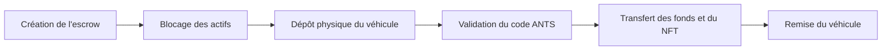
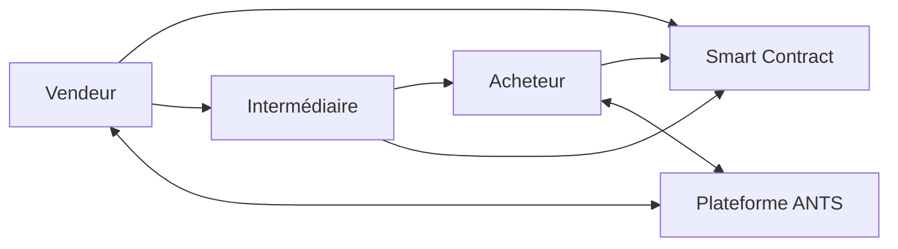
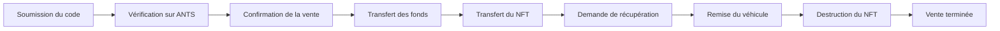
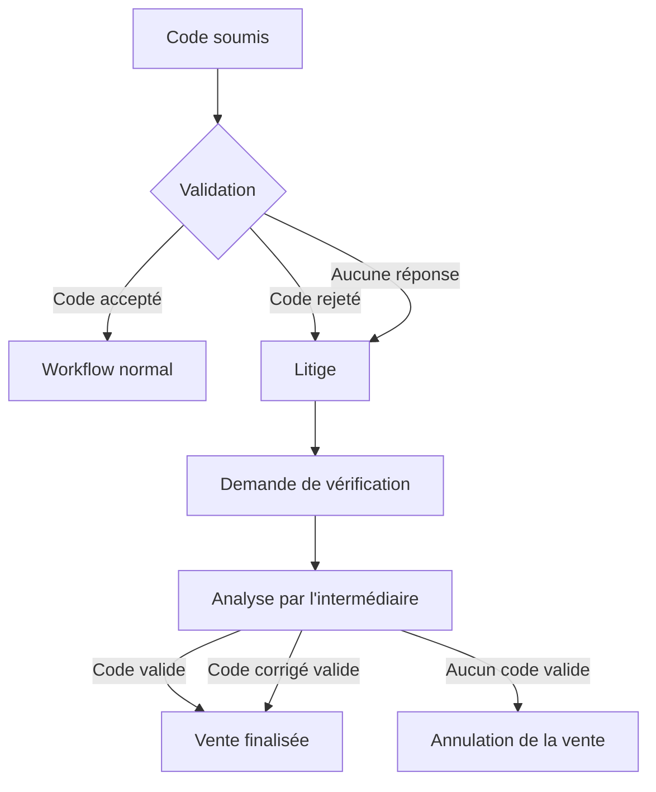
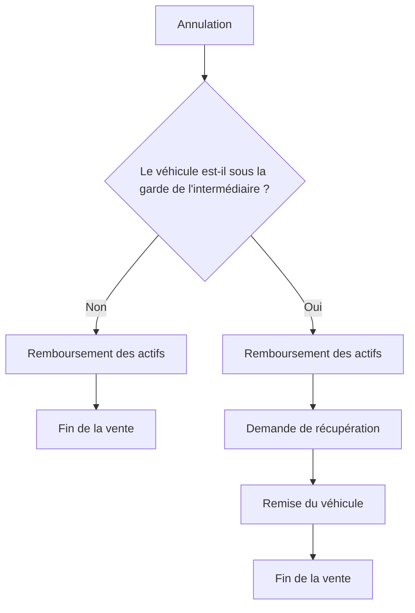
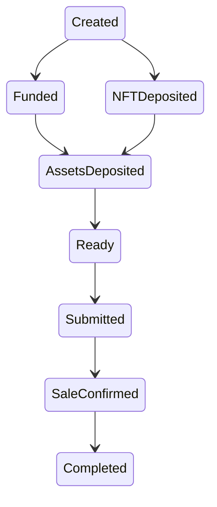
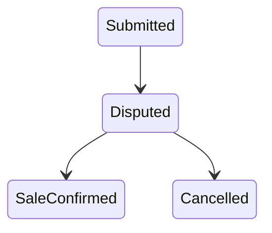

# 1. Introduction

## 1.1 Objectif

Le protocole **VehicleSaleEscrow** est un système d'entiercement (*escrow*) permettant de sécuriser la vente d'un véhicule entre deux particuliers à l'aide d'un smart contract.

Le protocole garantit que les différentes étapes de la transaction sont exécutées dans un ordre prédéfini et que les actifs numériques ne peuvent être transférés que lorsque les conditions requises sont satisfaites.

Contrairement à une vente classique, où les parties doivent se faire confiance, le protocole répartit les responsabilités entre la blockchain et un intermédiaire de confiance afin de limiter les risques de fraude et de protéger les intérêts de chaque participant.

Le smart contract assure notamment :

* la conservation temporaire du paiement de l'acheteur ;
* la conservation du NFT représentant le véhicule ;
* le contrôle des différentes étapes de la vente ;
* la gestion des délais imposés à chaque participant ;
* la résolution des litiges liés au code de cession ;
* la distribution automatique des fonds lorsque les conditions sont remplies.

---

## 1.2 Acteurs

Le protocole fait intervenir trois acteurs.

### Vendeur

Le vendeur est le propriétaire initial du véhicule.

Il est responsable de :

* déposer le NFT du véhicule dans le contrat d'escrow ;
* déposer physiquement le véhicule chez l'intermédiaire ;
* générer le code de cession ANTS ;
* transmettre le code de cession chiffré ;
* demander une vérification lorsque cela est nécessaire ;
* récupérer le véhicule si la vente est annulée après son dépôt.

---

### Acheteur

L'acheteur est la personne souhaitant acquérir le véhicule.

Il est responsable de :

* déposer le prix du véhicule dans l'escrow ;
* vérifier le code de cession sur la plateforme ANTS ;
* confirmer ou rejeter le code fourni ;
* payer les frais de récupération du véhicule ;
* récupérer physiquement le véhicule auprès de l'intermédiaire.

---

### Intermédiaire

L'intermédiaire est une **entité de confiance** chargée des opérations impliquant le véhicule physique.

Il intervient notamment pour :

* recevoir le véhicule en dépôt ;
* confirmer sa mise sous garde ;
* vérifier un code de cession lorsqu'un litige survient ;
* remettre le véhicule à l'acheteur après la vente ;
* restituer le véhicule au vendeur si la vente est annulée.

Le protocole suppose que l'intermédiaire agit honnêtement lorsqu'il confirme les événements physiques et lorsqu'il intervient dans la résolution d'un litige.

---

## 1.3 Actifs manipulés

Le protocole manipule quatre types d'actifs.

### NFT du véhicule

Le véhicule est représenté par un NFT qui matérialise sa propriété numérique pendant toute la durée de la transaction.

Le NFT est déposé dans le contrat d'escrow par le vendeur et reste verrouillé jusqu'à la finalisation ou l'annulation de la vente.

---

### Paiement

Le prix du véhicule est déposé par l'acheteur sous la forme d'un token ERC20.

Les fonds restent bloqués dans le contrat jusqu'à ce que toutes les conditions de la vente soient satisfaites.

---

### Code de cession

Le code de cession généré par la plateforme ANTS n'est jamais stocké en clair sur la blockchain.

Le vendeur chiffre ce code avant de le transmettre au smart contract, qui conserve également son empreinte cryptographique (*hash*) afin de permettre une vérification ultérieure.

---

### Frais

Le protocole prévoit trois catégories de frais :

* **Frais de dépôt**, versés à l'intermédiaire après confirmation du dépôt physique du véhicule.
* **Frais de récupération**, versés à l'intermédiaire lors de la remise du véhicule.
* **Frais de vérification**, utilisés lorsqu'un litige nécessite l'intervention de l'intermédiaire.

---

## 1.4 Vue d'ensemble du protocole

Une vente suit le déroulement général suivant :

Les détails de chacune de ces étapes sont présentés dans les chapitres suivants.

Le protocole distingue clairement les opérations réalisées **sur la blockchain** des opérations réalisées **dans le monde réel**. Les interactions financières, le transfert du NFT et l'application des règles du protocole sont exécutés par le smart contract, tandis que les démarches administratives liées à ANTS ainsi que la remise physique du véhicule sont effectuées hors chaîne sous la supervision de l'intermédiaire.

# 2. Architecture générale

Le protocole **VehicleSaleEscrow** repose sur une architecture hybride combinant un smart contract exécuté sur la blockchain et des opérations réalisées hors chaîne (*off-chain*). Cette séparation permet de bénéficier de la transparence et de l'automatisation offertes par la blockchain tout en intégrant des événements physiques qui ne peuvent pas être vérifiés directement par un smart contract.

---

## 2.1 Vue d'ensemble de l'architecture

Le protocole s'articule autour de trois composants principaux :

* le **smart contract**, qui applique les règles du protocole et conserve temporairement les actifs numériques ;
* la **plateforme ANTS**, utilisée pour les démarches administratives liées à la cession du véhicule ;
* l'**intermédiaire**, chargé des opérations physiques et de la résolution des litiges.

Le smart contract constitue l'autorité centrale du protocole. Aucune opération financière ou changement de propriétaire numérique ne peut être réalisé sans respecter les règles qu'il impose.

---

## 2.2 Responsabilités du smart contract

Le smart contract est responsable de toutes les opérations pouvant être exécutées de manière déterministe sur la blockchain.

Il assure notamment :

* la conservation temporaire du paiement de l'acheteur ;
* la conservation du NFT représentant le véhicule ;
* le contrôle des différentes étapes de la vente ;
* la gestion des délais associés à chaque étape ;
* la gestion des litiges ;
* la distribution automatique des fonds ;
* le transfert du NFT lorsque les conditions sont satisfaites.

Le contrat ne prend aucune décision basée sur des informations qu'il ne peut pas vérifier lui-même. Toutes les transitions d'état reposent exclusivement sur des transactions signées par les acteurs autorisés.

---

## 2.3 Rôle des opérations off-chain

Certaines étapes de la vente ne peuvent pas être exécutées directement sur la blockchain.

Elles sont réalisées hors chaîne, notamment :

* le dépôt physique du véhicule ;
* la génération du code de cession via ANTS ;
* la vérification du code sur la plateforme ANTS ;
* la remise physique du véhicule ;
* la restitution éventuelle du véhicule au vendeur.

Le smart contract ne cherche pas à reproduire ces opérations. Il enregistre uniquement les confirmations fournies par les participants autorisés afin de poursuivre le workflow.

---

## 2.4 Modèle de confiance

Le protocole repose sur un modèle de confiance simple.

Les participants ne sont pas supposés se faire confiance mutuellement.

En revanche, l'intermédiaire est considéré comme une entité de confiance.

Cette hypothèse lui permet notamment de :

* confirmer que le véhicule a bien été déposé ;
* confirmer que le véhicule a été remis à son nouveau propriétaire ;
* vérifier un code de cession lorsqu'un litige survient.

Le smart contract applique automatiquement les conséquences des décisions prises par l'intermédiaire, sans chercher à les vérifier lui-même.

---

## 2.5 Machine à états

Le protocole est implémenté sous la forme d'une **machine à états finis** (*Finite State Machine*).

Chaque vente évolue progressivement à travers différents états représentant son avancement.

Une opération ne peut être exécutée que si elle est compatible avec l'état courant de la vente.

Ce fonctionnement présente plusieurs avantages :

* empêcher les actions exécutées dans un ordre incorrect ;
* garantir qu'une même étape ne puisse être réalisée plusieurs fois ;
* simplifier la vérification du comportement du protocole ;
* rendre le contrat plus facile à auditer.

La description détaillée des différents états est présentée au **chapitre 6**.

---

## 2.6 Gestion des délais

Afin d'éviter qu'une transaction reste bloquée indéfiniment, plusieurs délais sont définis au cours du workflow.

Ces délais permettent notamment de limiter :

* le temps laissé au vendeur pour transmettre le code de cession ;
* le temps laissé à l'acheteur pour confirmer ce code ;
* le délai durant lequel une vérification peut être demandée.

À l'expiration de certains délais, le protocole autorise automatiquement de nouvelles actions, comme le lancement d'une procédure de vérification ou l'annulation de la vente.

---

## 2.7 Gestion des litiges

Le protocole distingue le déroulement normal d'une vente des situations nécessitant l'intervention de l'intermédiaire.

Lorsqu'un litige survient, la vente est temporairement suspendue.

L'intermédiaire analyse alors la situation hors chaîne, puis enregistre sa décision sur la blockchain.

Selon le résultat de cette vérification, le protocole poursuit la vente ou déclenche sa procédure d'annulation.

Le fonctionnement détaillé de ce mécanisme est présenté au **chapitre 4**.

---

## 2.8 Principes de conception

L'architecture du protocole repose sur les principes suivants :

* **Automatisation** : toutes les règles pouvant être exécutées par un smart contract sont appliquées automatiquement.
* **Déterminisme** : une même séquence d'actions produit toujours le même résultat.
* **Séparation des responsabilités** : les opérations numériques sont réalisées sur la blockchain, tandis que les opérations physiques restent hors chaîne.
* **Traçabilité** : chaque étape importante est enregistrée sous forme d'événement sur la blockchain.
* **Sécurité** : les actifs restent verrouillés jusqu'à ce que les conditions du protocole soient satisfaites.

Cette approche permet d'obtenir un protocole simple à comprendre, tout en garantissant que les fonds et les actifs numériques restent protégés tout au long du processus de vente.

# 3. Déroulement d'une vente

Ce chapitre décrit le déroulement normal d'une vente lorsque chaque participant respecte les différentes étapes du protocole.

Le processus débute par le déploiement du contrat d'escrow et se termine par la remise physique du véhicule à l'acheteur. 

---

## 3.1 Création de l'escrow

La vente commence par le déploiement d'une nouvelle instance du contrat **VehicleSaleEscrow**.

Lors de cette étape, l'ensemble des paramètres de la transaction est défini de manière définitive :

* le vendeur ;
* l'acheteur ;
* l'intermédiaire ;
* le contrat ERC20 utilisé pour le paiement ;
* le contrat NFT représentant le véhicule ;
* l'identifiant du NFT ;
* le prix de vente ;
* les différents frais du protocole.

Une fois le contrat déployé, ces informations ne peuvent plus être modifiées.

À ce stade, aucun actif n'a encore été transféré vers l'escrow.

---

## 3.2 Dépôt des actifs numériques

Avant toute interaction avec le véhicule physique, les deux parties doivent déposer les actifs numériques nécessaires à la vente.

### Dépôt du paiement

L'acheteur transfère au contrat :

* le prix du véhicule ;
* les frais de vérification.

Ces fonds sont alors verrouillés dans l'escrow jusqu'à ce que les conditions de la vente soient remplies.

---

### Dépôt du NFT

Le vendeur transfère ensuite le NFT représentant le véhicule vers le contrat.

Le NFT est conservé par l'escrow pendant toute la durée de la transaction.

Selon l'ordre dans lequel ces deux opérations sont réalisées, le contrat évolue progressivement jusqu'à l'état où les deux actifs sont simultanément sous son contrôle.

À partir de ce moment, la préparation de la vente est terminée et le véhicule peut être remis à l'intermédiaire.

---

## 3.3 Dépôt physique du véhicule

Une fois les actifs numériques sécurisés, le vendeur dépose physiquement le véhicule auprès de l'intermédiaire.

Cette étape est réalisée entièrement hors chaîne.

L'intermédiaire devient alors responsable de la garde du véhicule jusqu'à la fin de la transaction.

Après avoir vérifié que le véhicule a bien été remis, l'intermédiaire confirme ce dépôt sur la blockchain.

Cette confirmation produit plusieurs effets :

* le contrat autorise la poursuite de la vente ;
* les frais de dépôt sont versés à l'intermédiaire ;
* un délai est ouvert pour permettre au vendeur de transmettre le code de cession.

Le véhicule reste sous la garde de l'intermédiaire jusqu'à la finalisation ou à l'annulation de la vente.

---

## 3.4 Génération du code de cession

Après confirmation du dépôt du véhicule, le vendeur réalise la procédure administrative de cession sur la plateforme **ANTS**.

Cette démarche est entièrement réalisée hors chaîne.

À l'issue de cette procédure, ANTS génère un code de cession permettant à l'acheteur de poursuivre les démarches administratives liées au changement de propriétaire.

Afin de préserver la confidentialité de ce code, le protocole ne l'enregistre jamais en clair sur la blockchain.

Avant de communiquer avec le smart contract, le vendeur :

1. chiffre le code de cession ;
2. calcule son empreinte cryptographique (*hash*) ;
3. transmet ces deux informations au contrat.

Le code chiffré permettra à l'acheteur de récupérer la valeur originale, tandis que le hash servira ultérieurement à vérifier l'intégrité du code en cas de litige.

---

## 3.5 Transmission du code de cession

Le vendeur dispose d'un délai limité pour transmettre le code de cession.

Lorsqu'il soumet le code chiffré au contrat, celui-ci :

* enregistre le code chiffré ;
* enregistre son hash ;
* ouvre une nouvelle période durant laquelle l'acheteur doit vérifier le code.

À partir de cette étape, le vendeur ne peut plus modifier librement les informations transmises.

Toute correction éventuelle devra passer par la procédure de résolution des litiges décrite au chapitre suivant.

Le contrat attend désormais la décision de l'acheteur concernant la validité du code de cession.

---

## 3.6 Vérification du code de cession

Après la soumission du code de cession chiffré, l'acheteur peut le récupérer depuis le smart contract.

Le déchiffrement du code est réalisé **hors chaîne** à l'aide du mécanisme de chiffrement convenu entre les parties.

Une fois le code obtenu, l'acheteur se connecte à la plateforme **ANTS** afin de vérifier qu'il est valide et qu'il correspond bien au véhicule concerné.

À ce stade, deux situations sont possibles :

* le code est valide et l'acheteur confirme la vente ;
* le code est invalide, ou l'acheteur ne répond pas avant l'expiration du délai prévu.

Les deux derniers cas sont traités par le mécanisme de résolution des litiges décrit au chapitre suivant.

---

## 3.7 Confirmation de la vente

Lorsque l'acheteur confirme la validité du code de cession, le smart contract finalise automatiquement la transaction numérique.

Les opérations suivantes sont exécutées atomiquement :

* le prix du véhicule est transféré au vendeur ;
* les frais de vérification déposés par l'acheteur lui sont remboursés ;
* le NFT représentant le véhicule est transféré à l'acheteur.

À l'issue de cette étape :

* le vendeur a reçu le paiement ;
* l'acheteur devient propriétaire du NFT ;
* l'intermédiaire conserve toujours la garde physique du véhicule.

Le protocole considère alors que la vente est finalisée sur le plan numérique.

---

## 3.8 Demande de récupération du véhicule

Bien que la vente soit terminée sur la blockchain, le véhicule reste encore sous la responsabilité de l'intermédiaire.

L'acheteur doit donc demander sa récupération.

Pour cela, il :

* initie une demande de récupération auprès du smart contract ;
* verse les frais de récupération prévus par le protocole.

Ces frais rémunèrent l'intermédiaire pour la remise physique du véhicule.

---

## 3.9 Remise physique du véhicule

Après avoir reçu la demande de récupération, l'intermédiaire organise la remise du véhicule à l'acheteur.

Cette étape est entièrement réalisée **hors chaîne**.

Avant la remise, l'intermédiaire peut notamment vérifier :

* l'identité de l'acheteur ;
* les documents administratifs nécessaires ;
* toute autre condition imposée par son propre processus de remise.

Une fois le véhicule remis, l'intermédiaire confirme cette opération sur la blockchain.

Le smart contract :

* transfère les frais de récupération à l'intermédiaire ;
* détruit définitivement le NFT du véhicule ;
* marque la vente comme terminée.

Le NFT est brûlé car il n'a plus d'utilité une fois que :

* la propriété numérique a été transférée ;
* le véhicule a été physiquement remis à son nouveau propriétaire.

---

## 3.10 Fin du protocole

Après confirmation de la remise du véhicule, le contrat atteint son état final.

À ce stade :

* le vendeur a reçu le paiement du véhicule ;
* l'acheteur possède le véhicule ;
* l'intermédiaire a reçu les frais correspondant à ses prestations ;
* le NFT n'existe plus ;
* aucun actif ne reste bloqué dans le contrat.

L'instance du contrat **VehicleSaleEscrow** devient alors une trace permanente de la transaction réalisée.

# 4. Gestion des litiges

Bien que le protocole soit conçu pour permettre le déroulement normal d'une vente, certaines situations peuvent empêcher sa finalisation. Le principal point de blocage concerne la validation du code de cession ANTS.

Le protocole prévoit donc une procédure de résolution des litiges faisant intervenir l'intermédiaire de confiance.

Contrairement au déroulement normal de la vente, cette procédure permet à l'intermédiaire d'analyser la situation hors chaîne avant d'enregistrer sa décision sur la blockchain.

---

## 4.1 Origine d'un litige

Deux situations peuvent conduire à l'ouverture d'un litige.

### Rejet du code de cession

Après avoir vérifié le code sur la plateforme ANTS, l'acheteur peut constater qu'il est invalide.

Il rejette alors officiellement le code via le smart contract.

Le protocole suspend immédiatement la vente et ouvre une période durant laquelle le vendeur peut demander une vérification auprès de l'intermédiaire.

---

### Absence de réponse de l'acheteur

L'acheteur peut également ne fournir aucune réponse avant l'expiration du délai de confirmation.

Cette situation peut résulter :

* d'un oubli ;
* d'une indisponibilité ;
* ou d'un comportement volontaire visant à bloquer la transaction.

Afin d'éviter que la vente reste indéfiniment suspendue, le protocole autorise le vendeur à solliciter l'intervention de l'intermédiaire.

---

## 4.2 Demande de vérification

Lorsque le vendeur estime qu'une intervention est nécessaire, il peut demander une vérification.

Cette demande implique le versement des frais de vérification prévus par le protocole.

À partir de cet instant :

* la vente reste suspendue ;
* aucune des parties ne peut finaliser la transaction sans la décision de l'intermédiaire.

---

## 4.3 Vérification réalisée par l'intermédiaire

La vérification est entièrement réalisée hors chaîne.

L'intermédiaire analyse les éléments fournis par le vendeur et peut notamment :

* assister le vendeur lors de la consultation de son espace personnel ANTS ;
* vérifier que le code correspond bien à la cession concernée ;
* constater si une erreur de saisie est à l'origine du litige.

Le protocole suppose que l'intermédiaire agit honnêtement et enregistre une décision conforme aux informations observées.

Le smart contract ne cherche jamais à reproduire cette vérification.

Il applique uniquement les conséquences de la décision enregistrée par l'intermédiaire.

---

## 4.4 Résultats possibles

La procédure de vérification peut aboutir à trois résultats.

### Code initial valide

L'intermédiaire confirme que le code initial fourni par le vendeur était correct.

Le protocole considère alors que le rejet du code ou l'absence de réponse de l'acheteur n'était pas justifié.

La vente est immédiatement finalisée.

Le paiement est transféré au vendeur et le NFT est attribué à l'acheteur.

Les frais de vérification sont répartis conformément aux règles du protocole.

---

### Code corrigé valide

L'intermédiaire constate que le premier code était erroné mais qu'un nouveau code valide a été fourni par le vendeur.

Le smart contract met à jour :

* le code de cession chiffré ;
* son empreinte cryptographique.

La vente est ensuite finalisée de la même manière que lors d'une transaction classique.

---

### Aucun code valide

L'intermédiaire conclut qu'aucun code valide ne peut être fourni.

Dans ce cas, la vente est définitivement annulée.

Les fonds sont redistribués conformément aux règles du protocole et, si le véhicule est toujours sous la garde de l'intermédiaire, une procédure de récupération devra être engagée par le vendeur.

---

## 4.5 Répartition des frais de vérification

Le protocole prévoit plusieurs mécanismes de répartition des frais de vérification.

La distribution dépend du résultat de la procédure.

Selon la situation :

* les frais peuvent être remboursés à l'une des parties ;
* une partie peut être conservée par l'intermédiaire ;
* les frais peuvent être partagés entre plusieurs participants.

Cette approche vise à responsabiliser les différents acteurs tout en rémunérant l'intermédiaire lorsqu'une intervention est nécessaire.

Les règles précises de répartition sont définies par le smart contract.

---

## 4.6 Fin de la procédure

Une fois la décision enregistrée par l'intermédiaire, le protocole quitte l'état de litige.

Deux issues sont alors possibles :

* la vente reprend son cours normal jusqu'à sa finalisation ;
* la vente est annulée et la procédure de récupération du véhicule est engagée.

Le litige est alors considéré comme définitivement résolu.

# 5. Gestion des annulations

Le protocole prévoit plusieurs situations pouvant conduire à l'annulation d'une vente.

Contrairement aux litiges, dont l'objectif est de permettre la poursuite de la transaction, une annulation met définitivement fin au processus de vente. Le smart contract procède alors à la restitution des actifs numériques et, lorsque cela est nécessaire, déclenche la procédure de récupération du véhicule.

Selon l'étape à laquelle intervient l'annulation, les conséquences peuvent être différentes.

---

## 5.1 Annulation avant le dépôt physique du véhicule

La vente peut être annulée tant que l'intermédiaire n'a pas confirmé avoir reçu le véhicule.

Cette situation correspond à la phase de préparation de la transaction, durant laquelle les actifs numériques peuvent déjà être déposés dans l'escrow mais où le véhicule n'est pas encore sous la responsabilité de l'intermédiaire.

Dans ce cas :

* le prix du véhicule est remboursé à l'acheteur ;
* les frais de vérification sont également remboursés à l'acheteur ;
* le NFT est détruit, marquant la fin définitive de cette tentative de vente.

Aucune récupération physique du véhicule n'est nécessaire, celui-ci étant resté en possession du vendeur.

---

## 5.2 Absence de transmission du code de cession

Après confirmation du dépôt du véhicule, le vendeur dispose d'un délai limité pour transmettre le code de cession.

Si ce délai expire sans qu'aucun code ne soit soumis, la vente peut être annulée.

Le protocole considère alors que la transaction ne peut plus se poursuivre.

Le prix du véhicule est remboursé à l'acheteur et une procédure de récupération du véhicule devra être engagée afin que le vendeur puisse reprendre possession de son véhicule auprès de l'intermédiaire.

---

## 5.3 Absence de demande de vérification

Lorsqu'un litige est ouvert à la suite du rejet du code de cession, le vendeur dispose d'un délai pour demander l'intervention de l'intermédiaire.

Si aucune demande de vérification n'est effectuée avant l'expiration de ce délai, le protocole considère que le vendeur renonce à poursuivre la transaction.

La vente est alors annulée.

Comme le véhicule est toujours conservé par l'intermédiaire, une récupération physique sera nécessaire.

---

## 5.4 Échec de la procédure de vérification

Lorsque l'intermédiaire conclut qu'aucun code de cession valide ne peut être fourni, la vente est définitivement annulée.

Dans cette situation :

* le prix du véhicule est restitué à l'acheteur ;
* les frais sont répartis conformément aux règles du protocole ;
* le vendeur devra récupérer son véhicule auprès de l'intermédiaire.

Cette décision est définitive et met fin au litige.

---

## 5.5 Récupération du véhicule

Lorsque la vente est annulée après le dépôt physique du véhicule, celui-ci reste sous la garde de l'intermédiaire.

Le vendeur doit alors initier une procédure de récupération.

Cette étape comprend :

1. une demande de récupération auprès du smart contract ;
2. le paiement des frais de récupération ;
3. la remise physique du véhicule par l'intermédiaire.

Une fois le véhicule restitué, l'intermédiaire confirme cette opération sur la blockchain.

Le protocole considère alors que toutes les obligations des participants ont été exécutées.

---

## 5.6 Conséquences d'une annulation

Une annulation entraîne toujours la fermeture définitive de l'instance de vente.

Selon le scénario rencontré :

* les fonds sont remboursés ou redistribués conformément aux règles du protocole ;
* le NFT est détruit ;
* une récupération physique du véhicule peut être nécessaire.

Aucune opération ne permet ensuite de réactiver la vente.

Toute nouvelle tentative de vente devra être réalisée à l'aide d'une nouvelle instance du contrat.

# 6. États du protocole

Le protocole **VehicleSaleEscrow** est implémenté sous la forme d'une machine à états finis (*Finite State Machine*). Chaque vente évolue progressivement à travers différents états représentant son avancement.

À tout instant, une seule opération cohérente avec l'état courant peut être exécutée. Cette approche garantit que les participants respectent le déroulement prévu par le protocole et empêche l'exécution d'actions incompatibles avec l'avancement de la transaction.

---

## 6.1 États de la vente

Le tableau suivant présente les différents états pouvant être rencontrés au cours du cycle de vie d'une vente.

| État                | Description                                                                                                             |
| ------------------- | ----------------------------------------------------------------------------------------------------------------------- |
| **Created**         | Le contrat est déployé. Aucun actif n'a encore été déposé.                                                              |
| **Funded**          | Le prix du véhicule a été déposé par l'acheteur.                                                                        |
| **NFTDeposited**    | Le NFT représentant le véhicule a été déposé par le vendeur.                                                            |
| **AssetsDeposited** | Le paiement et le NFT sont simultanément conservés par l'escrow.                                                        |
| **Ready**           | Le véhicule a été déposé chez l'intermédiaire et celui-ci en a confirmé la réception.                                   |
| **Submitted**       | Le vendeur a transmis le code de cession chiffré.                                                                       |
| **SaleConfirmed**   | La vente est finalisée sur le plan numérique. Les fonds ont été transférés et le NFT appartient désormais à l'acheteur. |
| **Completed**       | Le véhicule a été physiquement remis à l'acheteur. La transaction est définitivement terminée.                          |
| **Cancelled**       | La vente a été annulée. Les actifs ont été redistribués conformément aux règles du protocole.                           |
| **Disputed**        | La vente est temporairement suspendue dans l'attente de la décision de l'intermédiaire.                                 |

---

## 6.2 Évolution des états

Dans le cas d'une vente sans incident, les états évoluent selon le schéma suivant.

Le protocole autorise le dépôt du paiement et du NFT dans n'importe quel ordre. Les deux actifs doivent toutefois être présents avant que le véhicule puisse être déposé chez l'intermédiaire.

---

## 6.3 États de litige

Lorsqu'un problème survient pendant la validation du code de cession, le protocole suspend temporairement la vente.

Le contrat entre alors dans l'état **Disputed**.

Cet état peut être atteint dans deux situations :

* l'acheteur rejette explicitement le code de cession ;
* l'acheteur ne répond pas avant l'expiration du délai prévu.

À partir de cet instant, seule la procédure de résolution des litiges peut permettre la poursuite de la vente ou son annulation.

---

## 6.4 Raisons de litige

Le protocole distingue deux causes de litige.

| Raison                 | Description                                                           |
| ---------------------- | --------------------------------------------------------------------- |
| **CodeRejected**       | L'acheteur déclare que le code de cession fourni est invalide.        |
| **BuyerDidNotRespond** | L'acheteur ne confirme pas le code avant l'expiration du délai prévu. |

Cette distinction permet au protocole d'appliquer des règles adaptées à chaque situation, notamment concernant les délais et la répartition des frais de vérification.

---

## 6.5 Résultats de la vérification

Après analyse de la situation, l'intermédiaire peut enregistrer l'un des résultats suivants.

| Résultat               | Description                                                                     |
| ---------------------- | ------------------------------------------------------------------------------- |
| **OriginalCodeValid**  | Le code initial fourni par le vendeur était valide.                             |
| **CorrectedCodeValid** | Le vendeur fournit un nouveau code valide pendant la procédure de vérification. |
| **NoValidCode**        | Aucun code valide ne peut être fourni. La vente est annulée.                    |

Ces résultats déterminent automatiquement la suite du protocole.

---

## 6.6 États finaux

Une instance du contrat ne peut se terminer que dans l'un des deux états suivants.

### Completed

La vente a été exécutée avec succès.

Toutes les obligations des participants ont été remplies :

* le vendeur a reçu le paiement ;
* l'acheteur a récupéré le véhicule ;
* l'intermédiaire a confirmé la remise du véhicule.

---

### Cancelled

La vente ne peut plus être poursuivie.

Les actifs numériques ont été redistribués conformément aux règles du protocole et, lorsque cela était nécessaire, la procédure de récupération du véhicule a été exécutée.

Une fois cet état atteint, aucune transition supplémentaire n'est possible.

---

## 6.7 Vue d'ensemble

Le diagramme suivant résume l'ensemble des transitions possibles.

Cette représentation met en évidence que le protocole ne possède que deux issues possibles : une vente finalisée (`Completed`) ou une vente définitivement annulée (`Cancelled`).

# 7. Référence des fonctions

Ce chapitre présente l'ensemble des fonctions publiques du contrat **VehicleSaleEscrow** en les regroupant par acteur. Il ne décrit pas leur implémentation, mais leur rôle dans le protocole.

---

## 7.1 Fonctions de l'acheteur

| Fonction                   | Description                                                                              |
| -------------------------- | ---------------------------------------------------------------------------------------- |
| **fundVehiclePrice()**     | Dépose le prix du véhicule ainsi que les frais de vérification dans le contrat d'escrow. |
| **confirmTransferCode()**  | Confirme que le code de cession est valide et déclenche la finalisation de la vente.     |
| **rejectTransferCode()**   | Indique que le code de cession fourni est invalide et ouvre une procédure de litige.     |
| **requestVehiclePickup()** | Demande la remise du véhicule et verse les frais de récupération.                        |

---

## 7.2 Fonctions du vendeur

| Fonction                              | Description                                                                                  |
| ------------------------------------- | -------------------------------------------------------------------------------------------- |
| **depositVehicleNFT()**               | Dépose le NFT représentant le véhicule dans le contrat d'escrow.                             |
| **requestVehicleDeposit()**           | Indique que le véhicule a été remis à l'intermédiaire et demande sa confirmation.            |
| **submitEncryptedTransferCode()**     | Transmet au contrat le code de cession chiffré ainsi que son empreinte cryptographique.      |
| **requestTransferCodeVerification()** | Demande l'intervention de l'intermédiaire afin de résoudre un litige lié au code de cession. |
| **requestVehicleRecovery()**          | Initie la récupération du véhicule lorsqu'une vente est annulée après son dépôt physique.    |

---

## 7.3 Fonctions de l'intermédiaire

| Fonction                      | Description                                                                                                         |
| ----------------------------- | ------------------------------------------------------------------------------------------------------------------- |
| **confirmVehicleDeposit()**   | Confirme la réception physique du véhicule et autorise la poursuite de la vente.                                    |
| **resolveDispute()**          | Enregistre le résultat de la vérification du code de cession et applique les conséquences prévues par le protocole. |
| **confirmVehiclePickup()**    | Confirme la remise du véhicule à l'acheteur et clôt définitivement la vente.                                        |
| **confirmVehicleRecovered()** | Confirme la restitution du véhicule au vendeur après une annulation.                                                |

---

## 7.4 Fonctions d'annulation

Les fonctions suivantes permettent de mettre fin à la vente lorsqu'une situation ne permet plus son déroulement normal.

| Fonction                                     | Description                                                                                                 |
| -------------------------------------------- | ----------------------------------------------------------------------------------------------------------- |
| **cancelBeforeVehicleDeposit()**             | Annule la vente avant que le dépôt physique du véhicule ne soit confirmé.                                   |
| **cancelAfterTransferCodeDeadline()**        | Annule la vente lorsque le vendeur ne transmet pas le code de cession dans le délai prévu.                  |
| **cancelAfterConfirmCodeDeadline()**         | Annule la vente lorsque le vendeur ne demande pas de vérification après l'absence de réponse de l'acheteur. |
| **cancelAfterVerificationRequestDeadline()** | Annule la vente lorsque le vendeur ne sollicite pas l'intermédiaire après le rejet du code de cession.      |

---

## 7.5 Fonctions de consultation

Le contrat met à disposition plusieurs fonctions permettant de consulter son état sans modifier la blockchain.

Ces fonctions permettent notamment de récupérer :

* les adresses des participants ;
* les adresses des contrats ERC20 et NFT ;
* les paramètres de la vente ;
* l'état courant du protocole ;
* les délais actifs ;
* les indicateurs de progression ;
* le code de cession chiffré (uniquement pour les participants autorisés) ;
* le hash du code de cession.

Ces fonctions sont principalement utilisées par les interfaces utilisateurs afin d'afficher l'état courant de la transaction.

---

## 7.6 Contrôle d'accès

Toutes les fonctions du contrat sont protégées par un contrôle d'accès.

Chaque opération ne peut être exécutée que par le participant autorisé.

| Acteur            | Fonctions autorisées                                                                                                |
| ----------------- | ------------------------------------------------------------------------------------------------------------------- |
| **Vendeur**       | Dépôt du NFT, transmission du code de cession, demande de dépôt, demande de vérification, récupération du véhicule. |
| **Acheteur**      | Dépôt du paiement, confirmation ou rejet du code, demande de récupération du véhicule.                              |
| **Intermédiaire** | Confirmation du dépôt du véhicule, résolution des litiges, confirmation des remises physiques.                      |

Cette séparation garantit qu'aucun participant ne puisse exécuter une action réservée à un autre acteur.

---

## 7.7 Fonctions internes

En plus des fonctions publiques, le contrat comporte plusieurs fonctions internes chargées de mutualiser certaines opérations communes.

Elles assurent notamment :

* l'annulation d'une vente ;
* la finalisation d'une vente après résolution d'un litige ;
* la distribution des fonds ;
* les transferts de tokens ERC20.

Ces fonctions ne peuvent jamais être appelées directement par les utilisateurs. Elles sont uniquement utilisées par le smart contract afin de limiter la duplication de code et de garantir un comportement cohérent dans l'ensemble du protocole.

# 8. Considérations de sécurité

Le protocole **VehicleSaleEscrow** a été conçu afin de protéger les actifs numériques des participants tout au long du processus de vente. Cette sécurité repose sur une combinaison de mécanismes techniques implémentés dans le smart contract et d'hypothèses concernant les opérations réalisées hors chaîne.

Ce chapitre présente les principaux principes de sécurité sur lesquels repose le protocole.

---

## 8.1 Contrôle des rôles

Chaque action du protocole est réservée à un acteur spécifique.

Le smart contract vérifie systématiquement l'identité de l'appelant avant d'autoriser l'exécution d'une fonction.

Cette séparation des responsabilités empêche notamment :

* un acheteur de réaliser une action réservée au vendeur ;
* un vendeur de confirmer lui-même une remise de véhicule ;
* un tiers d'intervenir dans une vente qui ne le concerne pas.

Cette approche garantit que chaque participant ne peut agir que dans le cadre des responsabilités qui lui sont attribuées.

---

## 8.2 Machine à états

Toutes les opérations sont conditionnées par l'état courant de la vente.

Avant chaque transition, le contrat vérifie que l'opération demandée est compatible avec le workflow.

Ce mécanisme empêche notamment :

* l'exécution d'une même étape plusieurs fois ;
* le contournement du déroulement prévu ;
* la réalisation d'une action dans un état inapproprié.

La machine à états constitue l'un des principaux mécanismes de sécurité du protocole.

---

## 8.3 Gestion des actifs

Pendant toute la durée de la transaction, le smart contract agit comme un dépositaire temporaire des actifs numériques.

Selon l'étape de la vente, il conserve :

* le paiement de l'acheteur ;
* le NFT représentant le véhicule ;
* certains frais liés au fonctionnement du protocole.

Les actifs ne sont transférés que lorsque les conditions prévues sont réunies.

Aucun participant ne peut récupérer un actif sans respecter les règles définies par le protocole.

---

## 8.4 Gestion des délais

Plusieurs délais sont utilisés afin d'éviter qu'une vente reste bloquée indéfiniment.

Ces délais limitent notamment :

* le temps laissé au vendeur pour transmettre le code de cession ;
* le temps laissé à l'acheteur pour le confirmer ;
* le délai disponible pour demander une vérification.

Lorsque ces délais expirent, le protocole autorise automatiquement les actions prévues, telles que la demande de vérification ou l'annulation de la vente.

---

## 8.5 Protection contre la réentrance

Les fonctions réalisant des transferts de fonds ou modifiant l'état interne du contrat sont protégées contre les attaques par réentrance.

Le contrat utilise un mécanisme de verrouillage empêchant qu'une fonction protégée puisse être exécutée plusieurs fois avant la fin de son exécution.

Cette protection contribue à préserver la cohérence des états internes et des transferts d'actifs.

---

## 8.6 Confidentialité du code de cession

Le code de cession ANTS constitue une information sensible.

Afin d'éviter son exposition sur la blockchain :

* il est chiffré avant d'être transmis au smart contract ;
* seul son hash est utilisé pour vérifier son intégrité ;
* le contrat ne stocke jamais sa version en clair.

Le déchiffrement est entièrement réalisé hors chaîne par les participants autorisés.

---

## 8.7 Modèle de confiance

Le protocole ne cherche pas à supprimer totalement la confiance entre les acteurs.

Il repose sur les hypothèses suivantes :

* le vendeur et l'acheteur peuvent être malveillants ou de mauvaise foi ;
* l'intermédiaire agit honnêtement dans toutes les opérations qui lui sont confiées ;
* les informations enregistrées par l'intermédiaire reflètent fidèlement les événements physiques.

Le smart contract applique automatiquement les décisions de l'intermédiaire sans chercher à les vérifier lui-même.

Cette approche permet d'intégrer des événements du monde réel qui ne peuvent pas être observés directement par la blockchain.

---

## 8.8 Limites du protocole

Comme tout système hybride, le protocole présente certaines limites.

En particulier, le smart contract ne peut pas vérifier directement :

* l'état réel du véhicule ;
* son kilométrage ;
* sa conformité mécanique ;
* l'identité physique des participants ;
* les informations affichées par la plateforme ANTS.

Ces éléments relèvent de la responsabilité de l'intermédiaire et des participants.

Le protocole garantit uniquement que les conséquences de ces événements sont appliquées conformément aux règles définies par le smart contract.

---

## 8.9 Résumé

Le protocole **VehicleSaleEscrow** combine les garanties offertes par la blockchain avec l'intervention d'un intermédiaire de confiance afin de sécuriser la vente d'un véhicule entre particuliers.

La sécurité du système repose sur quatre principes fondamentaux :

* **contrôle des rôles**, afin que chaque acteur n'exécute que les opérations qui lui sont autorisées ;
* **machine à états**, garantissant le respect du déroulement du protocole ;
* **protection des actifs**, assurant la conservation des fonds et du NFT jusqu'à la satisfaction des conditions de vente ;
* **séparation des responsabilités**, permettant au smart contract de gérer les actifs numériques tandis que l'intermédiaire supervise les événements physiques.

Cette architecture offre un compromis entre automatisation, transparence et intégration des contraintes propres à une transaction impliquant un bien physique.

