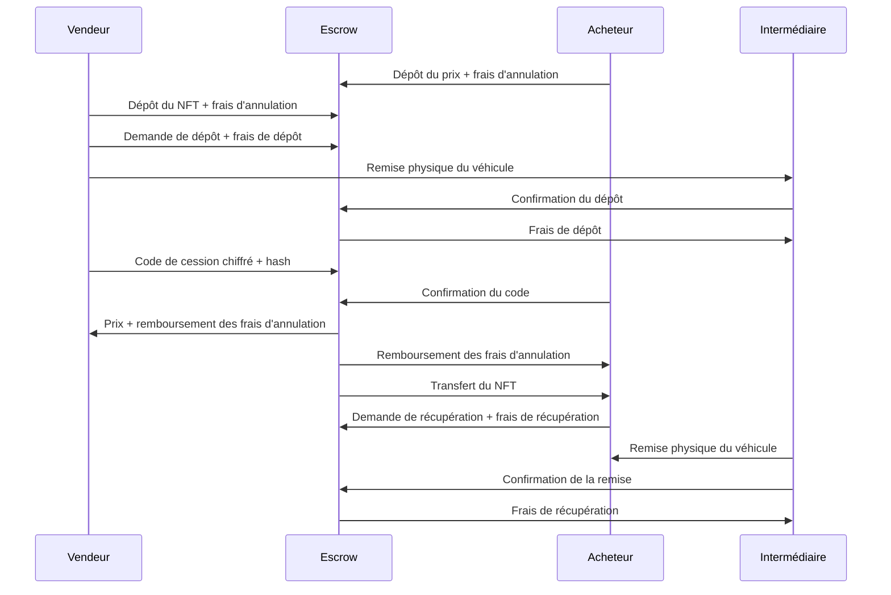
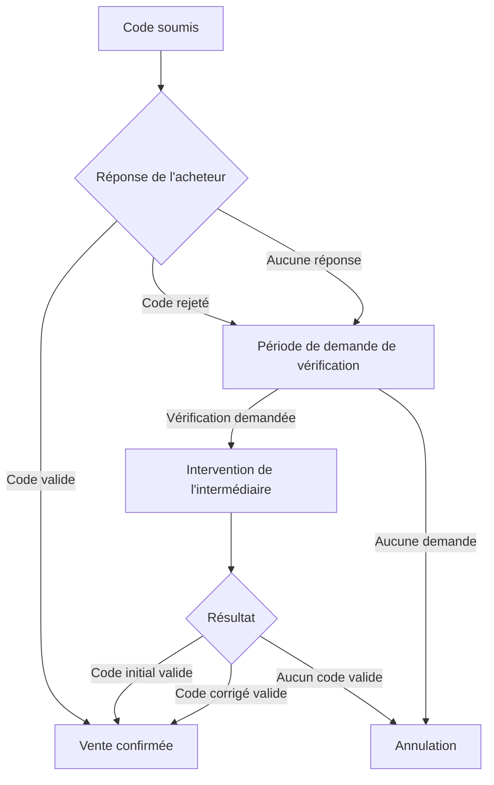
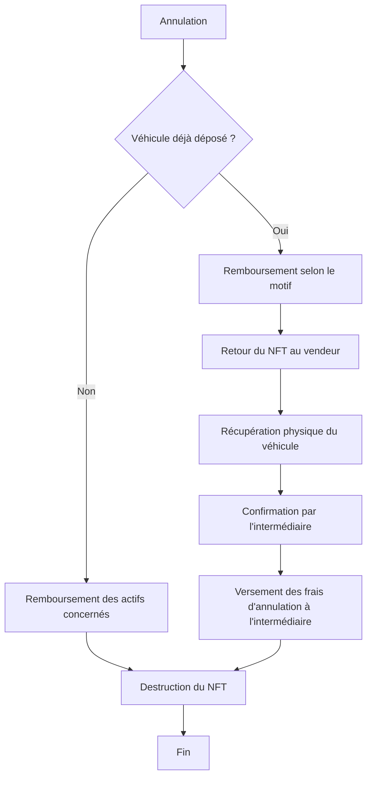
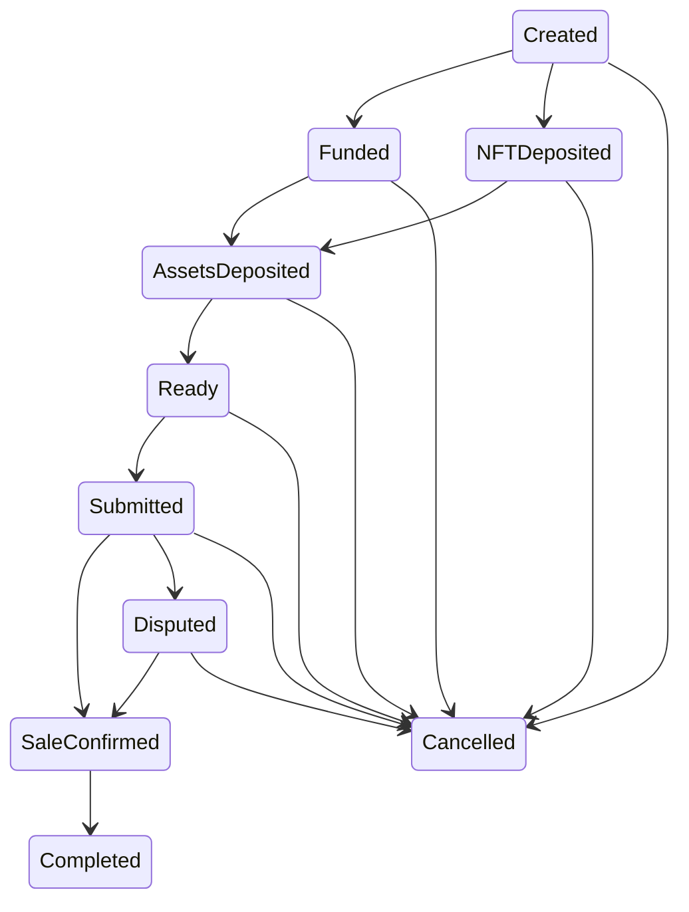

# Documentation du projet VehicleSaleEscrow

# 1. Introduction

## 1.1 Présentation

**VehicleSaleEscrow** est un smart contract Solidity implémentant un mécanisme d'entiercement (*escrow*) destiné à sécuriser la vente d'un véhicule entre deux particuliers.

Son objectif est de garantir que les actifs numériques impliqués dans la transaction sont transférés uniquement lorsque les conditions prévues par la vente sont satisfaites.

Le smart contract conserve temporairement les fonds déposés par l'acheteur et le vendeur ainsi que le NFT représentant le véhicule. Il contrôle l'enchaînement des différentes étapes, les délais, les annulations et la redistribution des actifs.

Certaines opérations nécessaires à la vente sont réalisées hors chaîne, notamment les démarches administratives liées au code de cession et les échanges physiques du véhicule. Elles ne font pas partie du fonctionnement du smart contract : celui-ci enregistre uniquement les confirmations envoyées par les participants afin de poursuivre le workflow on-chain.

---

## 1.2 Objectifs

Le smart contract poursuit plusieurs objectifs :

* sécuriser le paiement de la vente ;
* sécuriser le transfert du NFT représentant le véhicule ;
* garantir le respect du déroulement de la transaction ;
* encadrer les étapes sensibles par des délais ;
* permettre la résolution des litiges liés au code de cession ;
* automatiser la redistribution des actifs et des frais en cas de succès ou d'annulation de la vente.

---

## 1.3 Participants

Le système fait intervenir trois participants.

### Vendeur

Le vendeur est le propriétaire initial du véhicule.

Il est notamment responsable de :

* déposer le NFT représentant le véhicule ainsi que les frais d'annulation ;
* déposer physiquement le véhicule auprès de l'intermédiaire et payer les frais de dépôt ;
* transmettre le code de cession chiffré ainsi que son empreinte cryptographique (*hash*) ;
* demander une vérification lorsqu'un litige survient ;
* récupérer le véhicule auprès de l'intermédiaire lorsqu'une vente est annulée après son dépôt physique.

---

### Acheteur

L'acheteur est responsable de :

* déposer le prix du véhicule ainsi que les frais d'annulation ;
* récupérer et vérifier le code de cession afin de le confirmer ou de le rejeter ;
* demander la récupération du véhicule lorsque la vente est confirmée ;
* payer les frais de récupération associés à la remise du véhicule.

---

### Intermédiaire

L'intermédiaire est une entité de confiance chargée de confirmer les opérations qui ne peuvent pas être vérifiées directement par la blockchain.

Il intervient notamment pour :

* confirmer le dépôt physique du véhicule ;
* résoudre les litiges liés au code de cession ;
* confirmer la remise du véhicule à l'acheteur ;
* confirmer la récupération du véhicule par le vendeur lorsqu'une vente est annulée.

---

## 1.4 Actifs gérés

Le smart contract manipule deux actifs numériques.

### Fonds en ERC20

Les paiements sont effectués à l'aide d'un token ERC20 de type **stablecoin**, afin de conserver une valeur stable pendant toute la durée de la transaction.

L'acheteur dépose le prix du véhicule ainsi que les frais d'annulation dans le smart contract. L'ensemble de ces fonds reste bloqué jusqu'à ce que le déroulement de la vente détermine leur destination.

---

### NFT

Le véhicule est représenté par un NFT créé lors de la mise en place de la vente.

Le NFT est initialement attribué au vendeur, puis transféré au contrat d'escrow pendant la transaction.

Si la vente aboutit, il est transféré à l'acheteur puis détruit lorsque l'intermédiaire confirme la remise physique du véhicule.

En cas d'annulation avant le dépôt physique du véhicule, le NFT est détruit, qu'il soit encore détenu par le vendeur ou qu'il ait déjà été déposé dans l'escrow. En cas d'annulation après le dépôt physique, il est retourné au vendeur puis détruit lorsque l'intermédiaire confirme la récupération du véhicule.

---

## 1.5 Code de cession

Le vendeur transmet au smart contract :

* une version chiffrée du code de cession ;
* le hash correspondant.

Le code de cession n'est jamais stocké en clair sur la blockchain.

Son hash permet notamment, en cas de litige, de vérifier que le code validé par l'intermédiaire correspond au code initialement transmis ou d'identifier qu'un code corrigé a été fourni.

---

# 2. Architecture du smart contract

Le contrat **VehicleSaleEscrow** constitue la partie on-chain chargée de sécuriser chaque vente. Une instance distincte est créée pour chaque transaction.

Deux autres contrats participent à cette architecture :

* **VehicleSaleFactory**, qui crée une nouvelle vente, déploie son escrow et associe le NFT correspondant ;
* **VehicleNFT**, qui représente le véhicule et limite les transferts du NFT aux opérations prévues par la vente.

Les opérations extérieures à la blockchain ne sont pas exécutées par ces contrats. Elles sont confirmées on-chain par les participants concernés.

---

## 2.1 Machine à états

Le contrat est organisé sous la forme d'une **machine à états finis** (*Finite State Machine*).

Chaque vente évolue progressivement d'un état à un autre. Une opération ne peut être réalisée que lorsqu'elle correspond à l'étape actuelle de la transaction.

Cette organisation empêche, par exemple, de confirmer la remise du véhicule avant la confirmation de la vente ou de soumettre le code de cession avant le dépôt physique du véhicule.

La description détaillée des états est présentée au **chapitre 6**.

---

## 2.2 Contrôle d'accès

Les opérations sensibles sont réservées au participant concerné.

Selon l'étape :

* le vendeur réalise les actions liées au NFT, au dépôt du véhicule, au code de cession et à une éventuelle récupération du véhicule ;
* l'acheteur réalise les actions liées au paiement, à la validation du code et à la récupération du véhicule après une vente réussie ;
* l'intermédiaire confirme les opérations physiques et résout les litiges.

Le smart contract vérifie l'identité de l'appelant avant d'autoriser les actions concernées.

---

## 2.3 Gestion des délais

Trois périodes de **deux jours** encadrent les étapes liées au code de cession :

* le délai accordé au vendeur pour transmettre le code après confirmation du dépôt physique ;
* le délai accordé à l'acheteur pour confirmer ou rejeter le code ;
* le délai supplémentaire permettant au vendeur de demander une vérification lorsqu'un problème survient.

L'expiration d'un délai ne déclenche pas elle-même une transaction. Elle rend disponibles les actions prévues pour la situation concernée, notamment une demande de vérification ou une annulation.

---

## 2.4 Événements

Le smart contract émet des événements aux principales étapes de la transaction.

Ils permettent notamment de :

* suivre l'évolution de la vente ;
* faciliter l'intégration avec une interface utilisateur ;
* conserver un historique des opérations enregistrées sur la blockchain.

Une application peut ainsi suivre les dépôts, changements d'état, demandes, confirmations, litiges et annulations sans avoir à interpréter directement l'ensemble des données internes du contrat.

---

# 3. Déroulement d'une vente

Ce chapitre décrit le déroulement nominal d'une vente, depuis sa création jusqu'à la remise du véhicule à l'acheteur.

Les procédures de litige et d'annulation sont volontairement exclues de cette description et sont abordées dans les chapitres suivants.

---

## 3.1 Création de l'escrow

Une vente est créée par **VehicleSaleFactory**.

Lors de cette opération :

1. un nouveau NFT représentant le véhicule est créé au nom du vendeur ;
2. une nouvelle instance de **VehicleSaleEscrow** est déployée avec les paramètres de la transaction ;
3. le NFT est associé exclusivement à cet escrow.

Chaque vente dispose ainsi de son propre contrat d'escrow et de son propre NFT.

Les principaux paramètres définis à la création sont :

* le vendeur ;
* l'acheteur ;
* l'intermédiaire ;
* le stablecoin ERC20 utilisé pour les paiements ;
* le prix du véhicule ;
* les frais de dépôt ;
* les frais de récupération ;
* les frais d'annulation.

---

## 3.2 Dépôt des actifs

Avant de poursuivre la vente, l'acheteur et le vendeur doivent déposer les actifs prévus.

L'acheteur dépose le **prix du véhicule ainsi que ses frais d'annulation**.

Le vendeur dépose le **NFT ainsi que ses propres frais d'annulation**.

Ces deux opérations peuvent être effectuées dans n'importe quel ordre. Lorsque les deux dépôts sont réalisés, le smart contract peut passer à l'étape du dépôt physique du véhicule.

---

## 3.3 Dépôt physique du véhicule

Le vendeur demande ensuite le dépôt physique du véhicule et verse les **frais de dépôt**.

Le véhicule est remis à l'intermédiaire hors chaîne.

Après avoir vérifié sa réception, l'intermédiaire confirme le dépôt sur la blockchain.

Cette confirmation :

* transfère les frais de dépôt à l'intermédiaire ;
* autorise la poursuite de la vente ;
* ouvre une période de deux jours durant laquelle le vendeur doit transmettre le code de cession.

À partir de cette étape, une annulation implique également la récupération physique du véhicule par le vendeur.

---

## 3.4 Transmission du code de cession

Le vendeur transmet au smart contract le code de cession sous forme chiffrée ainsi que son hash.

Ces informations doivent être transmises pendant le délai de deux jours ouvert après la confirmation du dépôt du véhicule.

Une fois le code enregistré, une nouvelle période de deux jours commence afin de permettre à l'acheteur de le vérifier.

---

## 3.5 Vérification du code

L'acheteur récupère le code chiffré, le déchiffre et vérifie sa validité hors chaîne.

Si le code est valide, il confirme la vente.

Cette confirmation entraîne automatiquement :

* le transfert du prix du véhicule au vendeur ;
* le remboursement des frais d'annulation du vendeur ;
* le remboursement des frais d'annulation de l'acheteur ;
* le transfert du NFT à l'acheteur.

La vente est alors finalisée sur le plan numérique.

Si le code est rejeté ou si l'acheteur ne répond pas dans le délai prévu, les procédures décrites au chapitre 4 s'appliquent.

---

## 3.6 Remise du véhicule

Après la confirmation de la vente, l'acheteur demande la récupération du véhicule et dépose les **frais de récupération**.

L'intermédiaire remet physiquement le véhicule à l'acheteur puis confirme cette remise sur la blockchain.

Le smart contract :

* verse les frais de récupération à l'intermédiaire ;
* détruit le NFT représentant le véhicule ;
* marque définitivement la vente comme terminée.

---

# 4. Gestion des litiges

Une procédure de résolution des litiges est prévue lorsqu'un problème survient pendant la vérification du code de cession.

L'intermédiaire vérifie la situation hors chaîne, puis enregistre le résultat dans le smart contract. Le contrat applique ensuite automatiquement les conséquences financières et la destination du NFT.

---

## 4.1 Ouverture d'un litige

Deux situations peuvent conduire à une vérification.

### Rejet du code de cession

Si l'acheteur considère que le code transmis n'est pas valide, il peut le rejeter pendant le délai de confirmation.

La vente passe alors en litige et le vendeur dispose de deux jours pour demander l'intervention de l'intermédiaire.

---

### Absence de réponse de l'acheteur

Si l'acheteur ne confirme ni ne rejette le code pendant les deux jours prévus, une période de deux jours permettant au vendeur de demander une vérification débute à l'expiration du délai de confirmation

Lorsqu'il effectue cette demande, la vente passe en litige pour **absence de réponse de l'acheteur**.

Cette possibilité empêche l'acheteur de bloquer indéfiniment une vente simplement en restant inactif.

---

## 4.2 Demande de vérification

La demande de vérification est effectuée par le vendeur.

Elle peut intervenir :

* après un rejet du code par l'acheteur, pendant le délai prévu ;
* après l'expiration du délai de réponse de l'acheteur, pendant la période de demande de vérification.

Une fois la demande enregistrée, la résolution du litige dépend de l'intermédiaire.

Aucun nouveau dépôt de frais n'est demandé à cette étape : les frais d'annulation du vendeur et de l'acheteur sont déjà conservés par l'escrow depuis le début de la vente.

---

## 4.3 Vérification hors chaîne

L'intermédiaire vérifie les informations nécessaires hors chaîne afin de déterminer la situation réelle.

Trois résultats sont possibles :

* le code initial est valide ;
* un code corrigé est valide ;
* aucun code valide ne peut être fourni.

Le smart contract n'effectue pas lui-même cette vérification administrative. Il applique le résultat enregistré par l'intermédiaire.

---

## 4.4 Résolution du litige

### Code initial valide

L'intermédiaire confirme que le code initialement transmis par le vendeur est valide.

La vente est finalisée :

* le vendeur reçoit le prix du véhicule ;
* le NFT est transféré à l'acheteur ;
* l'intermédiaire reçoit un montant équivalent aux frais d'annulation ;
* le vendeur récupère un montant équivalent à ses frais d'annulation.

L'acheteur ne récupère donc pas ses frais d'annulation dans ce scénario.

---

### Code corrigé valide après rejet par l'acheteur

L'intermédiaire constate qu'un code corrigé valide doit remplacer le code initial.

Lorsque le litige provient d'un rejet de l'acheteur :

* le vendeur reçoit le prix du véhicule ;
* le NFT est transféré à l'acheteur ;
* l'intermédiaire reçoit un montant équivalent aux frais d'annulation ;
* l'acheteur récupère un montant équivalent à ses frais d'annulation.

Le vendeur ne récupère donc pas ses frais d'annulation.

---

### Code corrigé valide après absence de réponse de l'acheteur

Lorsque l'acheteur n'a pas répondu mais qu'un code corrigé est finalement nécessaire :

* le vendeur reçoit le prix du véhicule ;
* le NFT est transféré à l'acheteur ;
* l'intermédiaire reçoit un montant équivalent aux frais d'annulation ;
* le montant restant est partagé entre le vendeur et l'acheteur.

Le vendeur et l'acheteur supportent ainsi chacun une partie des conséquences du litige.

---

### Aucun code valide

Si l'intermédiaire conclut qu'aucun code valide ne peut être fourni, la vente est annulée.

L'acheteur récupère :

* le prix du véhicule ;
* un montant équivalent à ses frais d'annulation.

Le NFT est retourné au vendeur et le véhicule doit être récupéré auprès de l'intermédiaire.

Le montant restant correspondant aux frais d'annulation est conservé par l'escrow jusqu'à la confirmation de cette récupération, puis versé à l'intermédiaire.

---

## 4.5 Fin du litige

Une fois la décision de l'intermédiaire enregistrée, deux issues sont possibles :

* la vente est confirmée et se poursuit jusqu'à la remise du véhicule à l'acheteur ;
* la vente est annulée et le vendeur doit récupérer le véhicule auprès de l'intermédiaire.

---

# 5. Gestion des annulations

Plusieurs situations peuvent conduire à l'annulation définitive d'une vente.

Les conséquences dépendent principalement d'un élément : **le véhicule a-t-il déjà été physiquement déposé auprès de l'intermédiaire ?**

Avant ce dépôt, l'annulation peut être clôturée directement on-chain.

Après ce dépôt, le NFT est retourné au vendeur mais une étape supplémentaire est nécessaire pour confirmer la récupération physique du véhicule.

---

## 5.1 Annulation avant le dépôt du véhicule

La vente peut être annulée tant que la demande de dépôt physique n'a pas été engagée et que l'intermédiaire n'a pas confirmé la réception du véhicule.

Selon les actifs déjà déposés :

- l'acheteur récupère le prix du véhicule et ses frais d'annulation s'ils ont déjà été déposés ;
- le vendeur récupère ses frais d'annulation s'ils ont déjà été déposés ;
- le NFT est détruit, qu'il soit encore détenu par le vendeur ou qu'il ait déjà été déposé dans l'escrow.

Aucune récupération physique n'est nécessaire puisque le véhicule n'a pas été placé sous la garde de l'intermédiaire.
---

## 5.2 Dépassement du délai de transmission du code

Après confirmation du dépôt physique, le vendeur dispose de deux jours pour transmettre le code de cession.

Si ce délai expire, la vente peut être annulée.

Dans ce cas :

* l'acheteur récupère le prix du véhicule et ses frais d'annulation ;
* le NFT est retourné au vendeur ;
* le vendeur doit récupérer physiquement son véhicule auprès de l'intermédiaire ;
* les frais d'annulation restant dans l'escrow sont versés à l'intermédiaire lorsque cette récupération est confirmée.

---

## 5.3 Absence de demande de vérification

Deux situations sont distinguées.

### Après rejet du code par l'acheteur

Si l'acheteur rejette le code et que le vendeur ne demande pas de vérification pendant les deux jours prévus, la vente peut être annulée.

L'acheteur récupère le prix du véhicule et ses frais d'annulation. Le NFT retourne au vendeur et les frais d'annulation restant dans l'escrow servent à rémunérer l'intermédiaire lors de la récupération du véhicule.

---

### Après absence de réponse de l'acheteur

Si l'acheteur ne répond pas et que le vendeur ne demande pas de vérification pendant la période prévue, la vente peut également être annulée.

Dans ce cas :

* le vendeur récupère un montant équivalent à ses frais d'annulation ;
* l'acheteur récupère le prix du véhicule ;
* le NFT retourne au vendeur ;
* le véhicule doit être récupéré auprès de l'intermédiaire ;
* les frais d'annulation restant dans l'escrow sont versés à l'intermédiaire lorsque la récupération est confirmée.

---

## 5.4 Vérification infructueuse

Lorsque l'intermédiaire conclut qu'aucun code valide ne peut être fourni, la vente est annulée.

L'acheteur récupère le prix du véhicule ainsi qu'un montant équivalent à ses frais d'annulation.

Le NFT est retourné au vendeur et une récupération physique du véhicule devient nécessaire.

Les frais d'annulation restant dans l'escrow sont versés à l'intermédiaire lorsque celui-ci confirme que le vendeur a récupéré le véhicule.

---

## 5.5 Récupération du véhicule

Lorsqu'une vente est annulée après le dépôt physique du véhicule, le vendeur doit demander sa récupération.

L'intermédiaire remet le véhicule au vendeur puis confirme cette opération sur la blockchain.

Cette confirmation :

* clôt la procédure de récupération ;
* détruit le NFT retourné au vendeur lors de l'annulation ;
* transfère à l'intermédiaire les frais d'annulation restés dans l'escrow.

Les frais d'annulation servent donc également à rémunérer l'intermédiaire pour la gestion de la récupération du véhicule après une annulation.

---

## 5.6 Fin d'une vente annulée

Une fois l'annulation enregistrée, la vente ne peut pas être réactivée.

Deux situations finales sont possibles :

* **annulation avant dépôt physique** : les actifs concernés sont remboursés et le NFT est détruit ;
* **annulation après dépôt physique** : le NFT est retourné au vendeur, puis détruit après confirmation de la récupération du véhicule.

---

# 6. États du contrat

Les transitions entre les états sont contrôlées par le smart contract afin de garantir que chaque opération intervient au bon moment.

---

## 6.1 États de la vente

| État | Description |
| --- | --- |
| **Created** | La vente vient d'être créée. Aucun des deux dépôts initiaux n'est encore complet. |
| **Funded** | L'acheteur a déposé le prix du véhicule et ses frais d'annulation. |
| **NFTDeposited** | Le vendeur a déposé le NFT et ses frais d'annulation. |
| **AssetsDeposited** | Les dépôts de l'acheteur et du vendeur sont tous les deux conservés par l'escrow. |
| **Ready** | L'intermédiaire a confirmé la réception physique du véhicule. |
| **Submitted** | Le vendeur a transmis le code de cession chiffré et son hash. |
| **SaleConfirmed** | La vente est finalisée sur le plan numérique et le NFT appartient à l'acheteur. |
| **Completed** | Le véhicule a été remis à l'acheteur et le NFT a été détruit. |
| **Disputed** | Une procédure de litige liée au code de cession est en cours. |
| **Cancelled** | La vente est annulée. Une récupération physique du véhicule peut encore être nécessaire. |

---

## 6.2 Raisons de litige

Lorsqu'une vente entre dans l'état **Disputed**, le contrat enregistre l'origine du litige.

| Valeur | Description |
| --- | --- |
| **None** | Aucun litige n'est enregistré. |
| **CodeRejected** | L'acheteur a explicitement rejeté le code de cession. |
| **BuyerDidNotRespond** | L'acheteur n'a pas répondu pendant le délai de confirmation et le vendeur a demandé une vérification. |

Cette distinction permet d'appliquer une redistribution différente des frais d'annulation selon la situation.

---

## 6.3 Résultats de la vérification

L'intermédiaire peut enregistrer l'un des résultats suivants.

| Valeur | Description |
| --- | --- |
| **OriginalCodeValid** | Le code de cession initial est valide. |
| **CorrectedCodeValid** | Un nouveau code valide remplace le code initial. |
| **NoValidCode** | Aucun code de cession valide ne peut être fourni. |

Les deux premiers résultats permettent de confirmer la vente. Le troisième entraîne son annulation.

---

## 6.4 Vue d'ensemble des transitions

Ce diagramme représente les principales transitions possibles. Les conditions et conséquences de ces transitions sont détaillées dans les chapitres précédents.

---

# 7. Gestion des frais

Trois catégories de frais sont définies lors de la création de la vente :

* les frais de dépôt ;
* les frais de récupération ;
* les frais d'annulation.

Les deux premières catégories rémunèrent directement une prestation de l'intermédiaire. Les frais d'annulation ont un rôle plus large : ils sont déposés au début de la vente par les deux parties et leur destination dépend du déroulement de la transaction.

---

## 7.1 Frais de dépôt

Les **frais de dépôt** rémunèrent la prise en charge du véhicule par l'intermédiaire.

Ils sont déposés par le vendeur lorsqu'il demande le dépôt physique du véhicule.

Après réception du véhicule, l'intermédiaire confirme l'opération sur la blockchain et reçoit ces frais.

Une fois versés, ils restent acquis à l'intermédiaire même si la vente est annulée ultérieurement.

---

## 7.2 Frais de récupération

Les **frais de récupération** correspondent à la remise du véhicule à l'acheteur lorsque la vente aboutit.

Ils sont déposés par l'acheteur après la confirmation de la vente et sont transférés à l'intermédiaire lorsque celui-ci confirme la remise physique du véhicule.

---

## 7.3 Frais d'annulation

Le vendeur et l'acheteur déposent chacun un même montant de **frais d'annulation** au début de la transaction :

* l'acheteur les dépose avec le prix du véhicule ;
* le vendeur les dépose avec le NFT.

Dans le déroulement normal de la vente, les deux montants sont remboursés à leurs déposants lors de la confirmation du code.

En cas de litige ou d'annulation, leur répartition dépend de la situation.

### Vente confirmée sans litige

* l'acheteur récupère ses frais d'annulation ;
* le vendeur récupère ses frais d'annulation.

### Code initial valide après vérification

* le vendeur récupère un montant équivalent à ses frais d'annulation ;
* l'intermédiaire reçoit un montant équivalent aux frais d'annulation ;
* l'acheteur ne récupère pas son dépôt.

### Code corrigé après rejet par l'acheteur

* l'acheteur récupère un montant équivalent à ses frais d'annulation ;
* l'intermédiaire reçoit un montant équivalent aux frais d'annulation ;
* le vendeur ne récupère pas son dépôt.

### Code corrigé après absence de réponse de l'acheteur

* l'intermédiaire reçoit un montant équivalent aux frais d'annulation ;
* le montant restant est partagé entre le vendeur et l'acheteur.

### Aucun code valide

* l'acheteur récupère un montant équivalent à ses frais d'annulation ;
* l'autre montant reste disponible pour rémunérer l'intermédiaire lors de la récupération du véhicule par le vendeur.

### Annulation après dépôt physique

Lorsqu'une annulation nécessite que le vendeur récupère le véhicule, un montant de `cancellationFee` reste dans l'escrow et est transféré à l'intermédiaire lorsque cette récupération est confirmée.

La partie qui récupère immédiatement l'autre montant dépend de la cause de l'annulation, comme détaillé au chapitre 5.

---

## 7.4 Récapitulatif

| Frais | Déposé par | Moment du dépôt | Destination |
| --- | --- | --- | --- |
| **Frais de dépôt** | Vendeur | Demande de dépôt physique | Intermédiaire après confirmation du dépôt |
| **Frais de récupération** | Acheteur | Demande de récupération après confirmation de la vente | Intermédiaire après remise du véhicule |
| **Frais d'annulation** | Acheteur et vendeur | Avec leurs dépôts initiaux respectifs | Remboursés ou redistribués selon l'issue de la vente |

---

# 8. Interface du smart contract

Le contrat **VehicleSaleEscrow** expose les fonctions nécessaires aux trois participants pour faire progresser la vente.

Cette section présente leur rôle fonctionnel sans détailler leur implémentation interne.

---

## 8.1 Fonctions de gestion des actifs

| Fonction | Description |
| --- | --- |
| `fundVehiclePrice()` | Permet à l'acheteur de déposer le prix du véhicule et ses frais d'annulation. |
| `depositVehicleNFT()` | Permet au vendeur de déposer le NFT et ses frais d'annulation. |

---

## 8.2 Fonctions liées au dépôt et à la remise du véhicule

| Fonction | Description |
| --- | --- |
| `requestVehicleDeposit()` | Le vendeur demande le dépôt physique du véhicule et dépose les frais correspondants. |
| `confirmVehicleDeposit()` | L'intermédiaire confirme la réception du véhicule. |
| `requestVehiclePickup()` | L'acheteur demande la remise du véhicule et dépose les frais de récupération. |
| `confirmVehiclePickup()` | L'intermédiaire confirme la remise du véhicule à l'acheteur et clôt la vente. |
| `requestVehicleRecovery()` | Le vendeur demande la récupération du véhicule après une annulation. |
| `confirmVehicleRecovered()` | L'intermédiaire confirme la récupération, reçoit les frais d'annulation prévus et détruit le NFT. |

---

## 8.3 Fonctions liées au code de cession

| Fonction | Description |
| --- | --- |
| `submitEncryptedTransferCode()` | Enregistre le code de cession chiffré et son hash. |
| `confirmTransferCode()` | Permet à l'acheteur de confirmer le code et finalise la vente sur le plan numérique. |
| `rejectTransferCode()` | Permet à l'acheteur de rejeter le code et ouvre la période permettant au vendeur de demander une vérification. |
| `requestTransferCodeVerification()` | Permet au vendeur de demander l'intervention de l'intermédiaire. |

---

## 8.4 Fonctions de résolution des litiges

Ces fonctions sont réservées à l'intermédiaire.

| Fonction | Description |
| --- | --- |
| `resolveWithOriginalCode()` | Confirme que le code initial est valide. |
| `resolveWithCorrectedCode()` | Enregistre un code corrigé valide et confirme la vente. |
| `resolveWithNoValidCode()` | Constate qu'aucun code valide n'existe et annule la vente. |

---

## 8.5 Fonctions d'annulation

| Fonction | Description |
| --- | --- |
| `cancelBeforeVehicleDeposit()` | Annule la vente avant l'engagement de la procédure de dépôt physique. |
| `cancelAfterTransferCodeDeadline()` | Annule la vente lorsque le vendeur ne transmet pas le code dans le délai prévu. |
| `cancelAfterVerificationRequestDeadline()` | Annule la vente lorsque le vendeur ne demande pas de vérification après le rejet du code. |
| `cancelAfterConfirmAndVerificationCodeDeadline()` | Annule la vente lorsque l'acheteur ne répond pas et qu'aucune vérification n'est demandée pendant la période de demande de vérification. |

---

## 8.6 Informations principales conservées

Le contrat conserve les informations nécessaires au suivi de la vente :

### Participants

* vendeur ;
* acheteur ;
* intermédiaire.

### Actifs

* le stablecoin ERC20 utilisé pour les paiements ;
* contrat VehicleNFT ;
* identifiant du NFT.

### Paramètres financiers

* prix du véhicule ;
* frais de dépôt ;
* frais de récupération ;
* frais d'annulation.

### Suivi de la vente

* état courant ;
* raison éventuelle d'un litige ;
* code de cession chiffré et son hash ;
* demandes de dépôt, récupération ou vérification ;
* nécessité éventuelle de récupérer le véhicule après une annulation ;
* délais liés au code de cession.

---

## 8.7 Fonctions de consultation

Le contrat expose des fonctions de lecture permettant à une interface utilisateur de connaître l'état de la transaction sans modifier la blockchain.

Elles permettent notamment de consulter :

* les participants ;
* les paramètres financiers ;
* l'état courant de la vente ;
* la raison d'un éventuel litige ;
* l'avancement des différentes demandes ;
* les périodes de validité des délais ;
* le code de cession chiffré et son hash.

Ces informations permettent à l'interface de présenter à chaque participant les actions disponibles selon la situation actuelle.

---

# 9. Conclusion

Le smart contract **VehicleSaleEscrow** fournit un mécanisme d'entiercement permettant de sécuriser les échanges numériques associés à une vente de véhicule entre particuliers.

Il encadre le dépôt du paiement et du NFT, la transmission du code de cession, les délais, la résolution des litiges et les différents scénarios d'annulation. Les frais d'annulation déposés par le vendeur et l'acheteur permettent également d'appliquer automatiquement les conséquences financières prévues selon l'issue de la transaction.

Le système s'appuie sur **VehicleSaleFactory** pour créer les ventes et sur **VehicleNFT** pour représenter le véhicule tout en empêchant les transferts du NFT en dehors du workflow autorisé.

Les opérations physiques et administratives restent réalisées hors chaîne. L'intermédiaire de confiance confirme les événements du monde réel nécessaires au déroulement de la vente, notamment le dépôt et la remise du véhicule ainsi que la vérification du code de cession en cas de litige.

Cette séparation permet au smart contract de se concentrer sur ce qu'il peut contrôler de manière fiable : l'état de la transaction, les actifs numériques, les délais et l'application automatique des règles de la vente.
